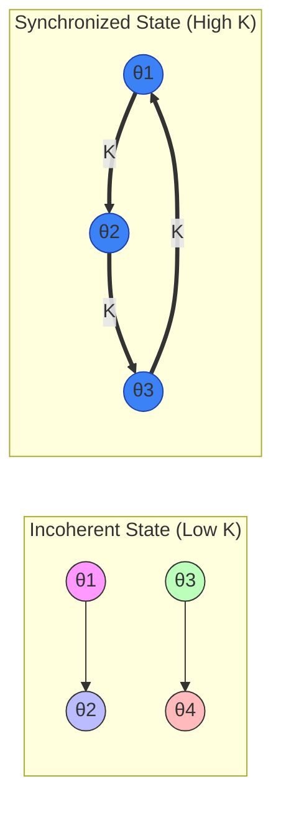

# Kuramoto Model

## Overview

The Kuramoto Model is a mathematical framework used to describe the collective synchronization of a large population of coupled oscillators. Introduced by Yoshiki Kuramoto in 1975, it has become the "standard model" for understanding how simple, individual agents can spontaneously align their behavior to create global coherence.

While originally developed for physical and biological systems (like fireflies flashing in unison or pacemaker cells in the heart), the model has recently found profound applications in **Artificial Intelligence** (for feature binding and robust neural networks) and **Finance** (for modeling market crashes and systemic risk).

## Mathematical Framework

The model considers $N$ oscillators, each with its own phase $\theta_i(t)$ and a natural frequency $\omega_i$. The frequencies are typically drawn from a distribution $g(\omega)$ (often a Gaussian or Cauchy distribution).

The evolution of each oscillator is governed by:

$$\frac{d\theta_i}{dt} = \omega_i + \frac{K}{N} \sum_{j=1}^{N} \sin(\theta_j - \theta_i)$$

Where:
- $\theta_i$ is the phase of the $i$-th oscillator.
- $\omega_i$ is its intrinsic natural frequency.
- $K$ is the **coupling strength**.
- $N$ is the total number of oscillators.

The term $\sin(\theta_j - \theta_i)$ ensures that oscillators try to pull each other toward their respective phases.

## Phase Transition & Order Parameter

To measure the degree of synchronization, Kuramoto introduced the **complex order parameter** $r(t)e^{i\psi(t)}$:

$$re^{i\psi} = \frac{1}{N} \sum_{j=1}^N e^{i\theta_j}$$

- $r \approx 0$: **Incoherence**. Oscillators are randomly distributed around the circle; their signals cancel out.
- $r \approx 1$: **Global Synchrony**. Oscillators move as a single coherent "flock."

As the coupling strength $K$ increases, the system undergoes a **phase transition** at a critical value $K_c$. Below $K_c$, the oscillators act independently. Above $K_c$, a "giant component" of synchronized oscillators emerges.

## AI Applications

Recent research has integrated Kuramoto dynamics into deep learning architectures to address fundamental challenges in computer vision and reasoning.

### 1. Artificial Kuramoto Oscillatory Neurons (AKOrN)
Traditional neurons use thresholding (like ReLU). In contrast, oscillatory neurons represent information via phase.
- **Feature Binding:** By allowing neurons to synchronize, a network can "bind" different features (e.g., the edges and color of a car) into a single object without explicit labels.
- **Unsupervised Discovery:** Synchronization acts as a natural grouping mechanism, allowing models to segment objects in an image by looking for clusters of synchronized neural activity.

### 2. Adversarial Robustness
Kuramoto-based networks are inherently more resilient to adversarial attacks. Because the output depends on the collective stability of many coupled oscillators, a small perturbation (noise) added to a single input is "damped out" by the coupling of the system, preventing the classification from flipping easily.

### 3. Solving Combinatorial Problems
Networks of Kuramoto oscillators can "compute" solutions to NP-hard problems (like Sudoku or graph coloring). The problem constraints are mapped to coupling strengths $K_{ij}$, and the solution corresponds to the stable synchronized state the system settles into.

## Finance Applications

In financial mathematics, the Kuramoto model is used to study the interconnectedness of global markets.

### 1. Market Synchronization & Crises
Stock prices and indexes can be viewed as oscillators. During "normal" times, markets exhibit a healthy level of diversity (low $r$). However, as a crash approaches, coupling increases, and the system moves toward **extreme synchronization** ($r \to 1$). When all participants act in lockstep, the market loses liquidity and becomes prone to catastrophic failure.

### 2. Systemic Risk
By modeling banks or financial institutions as oscillators, researchers can identify the "critical coupling" point where a failure in one node will synchronize failures across the entire network, leading to a systemic collapse.

## Visualization of Synchronization

The transition from chaos to order as $K$ increases:

## Related Topics

- [[pinns]] — solving the Kuramoto PDE via neural networks
- [[hamiltonian-nn]] — conservation laws in oscillatory systems
- [[complex-networks]] — topology of oscillator coupling
- [[stochastic-processes]] — noise in the Kuramoto model
- [[graph-theory]] — network structures for synchronization
