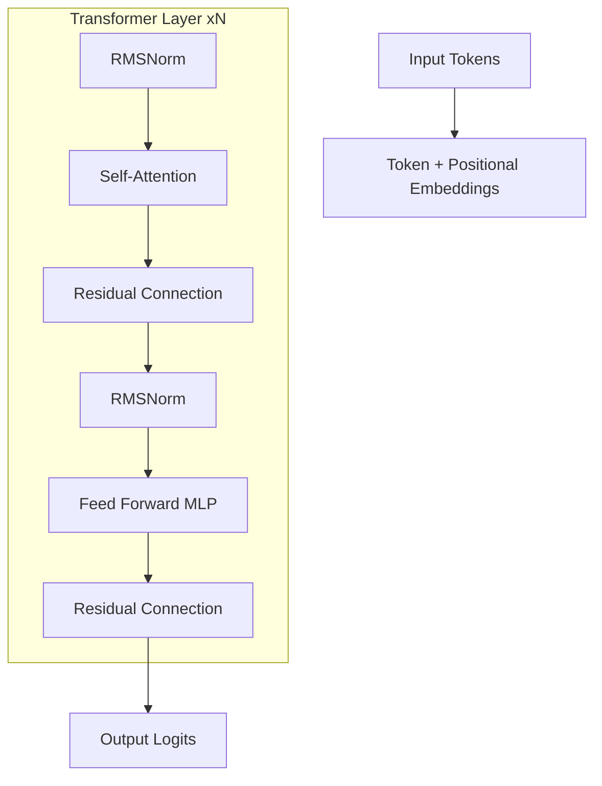

# Transformer Architecture: The Foundation of LLMs

The Transformer is the standard neural network architecture for natural language processing, computer vision, and more. It replaced recurrent and convolutional layers with the [[attention-mechanisms|Self-Attention]] mechanism, enabling massive parallelism and unprecedented scaling.

## 1. The Core Components

A standard Transformer (like GPT or Llama) consists of two main parts:
- **[[attention-mechanisms|Attention]] Layer**: Where tokens "talk" to each other to share context.
- **Feed-Forward Network (FFN)**: A point-wise multi-layer perceptron that processes each token individually to extract features.

## 2. Normalization: Stability at Scale

In the original paper, **Post-Norm** was used (Normalize *after* the residual connection). Modern models use **Pre-Norm**:
1.  **RMSNorm**: A faster variant of LayerNorm that only scales by the root mean square, ignoring the mean centering. 
2.  **Stability**: Pre-Norm allows training much deeper models (100+ layers) without the gradients exploding in the first few steps.

## 3. Positional Embeddings: Giving Time to Space

Since Attention is permutation-invariant (it doesn't care about order), we must manually inject order information.
- **Sinusoidal**: The original "static" wave-based approach.
- **RoPE (Rotary Positional Embeddings)**: The current SOTA (used in Llama/Mistral). It rotates the Query and Key vectors in complex space. This preserves **Relative Distance** information perfectly and allows the model to generalize to context lengths it has never seen during training.

## 4. The Softmax Bottleneck

In the final layer, the model predicts the next token from a vocabulary of ~100,000 words.
- This is a linear projection $W \cdot h$. 
- **The Bottleneck**: Mathematically, if the hidden dimension $d$ is smaller than the log of the vocabulary size, the model cannot represent all possible probability distributions of words. This is why scaling the "width" of the Transformer is as important as scaling its "depth."

## 5. Architectural Variants

- **Encoder-Only (BERT)**: Good for understanding/classification.
- **Decoder-Only (GPT)**: Good for generation.
- **Encoder-Decoder (T5)**: Good for translation.

## Visualization: The Layer Stack

## Related Topics

[[attention-mechanisms]] — the internal engine  
[[neural-scaling-laws]] — why we keep making Transformers bigger  
[[mixture-of-experts]] — a way to scale FFNs to trillions of parameters
---
