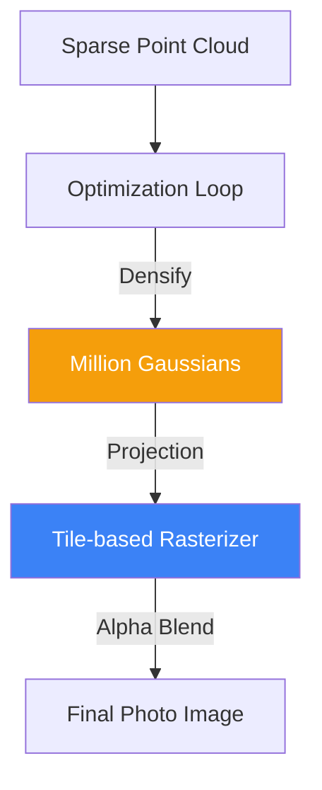

# 3D Gaussian Splatting: Real-Time Radiance Fields

**3D Gaussian Splatting (3DGS)** is a state-of-the-art technique for real-time radiance field rendering. Unlike [[nerf|NeRF]], which represents a scene as a continuous neural network (MLP), 3DGS represents a scene as a massive collection of millions of 3D Gaussian distributions (ellipsoids).

## 1. The Core Idea: Gaussians as Primitives

Each 3D Gaussian is defined by:
- **Position ($x, y, z$)**: The center of the ellipsoid.
- **Covariance Matrix ($\Sigma$)**: Defines the shape and orientation (stretch and rotation).
- **Opacity ($\alpha$)**: How transparent the Gaussian is.
- **Color**: Represented using **Spherical Harmonics (SH)** to capture how the color changes with the viewing angle.

## 2. The Rendering Pipeline: Splatting

Rendering in 3DGS is extremely fast because it uses a process called **Splatting**:
1.  **Projection**: 3D Gaussians are projected onto a 2D image plane.
2.  **Sorting**: The Gaussians are sorted by their distance from the camera (depth).
3.  **Alpha Blending**: For each pixel, the colors of the overlapping Gaussians are blended according to their opacity and depth:
    $$ C = \sum_{i \in N} c_i \alpha_i \prod_{j=1}^{i-1} (1 - \alpha_j) $$
This is a standard rasterization technique, allowing 3DGS to achieve **100+ FPS** at 4K resolution, whereas NeRF often struggles to reach 1 FPS.

## 3. Optimization and Learning

3DGS starts with a sparse point cloud (from COLMAP). During training:
- **Densification**: The system identifies areas with too few Gaussians (under-reconstructed) and splits them into smaller ones.
- **Pruning**: Gaussians with very low opacity are deleted to save memory.
- **Backpropagation**: The parameters (position, shape, color) of every Gaussian are optimized using gradient descent to match the input photos.

## 4. 3DGS vs. NeRF

| Feature | NeRF | 3D Gaussian Splatting |
| :--- | :--- | :--- |
| **Representation** | MLP (Weights) | Explicit Gaussians (Cloud) |
| **Training Speed** | Minutes to Hours | Minutes |
| **Rendering Speed** | Slow (Ray-marching) | Instant (Rasterization) |
| **Storage** | Very Compact (MBs) | Large (Hundreds of MBs) |
| **Editing** | Hard (Weights are cryptic) | Easy (Move/Scale Gaussians) |

## 5. Applications

- **Virtual Reality**: Creating photorealistic digital twins of real rooms for 6DOF movement.
- **E-commerce**: Instant 3D previews of products on mobile devices.
- **Robotics**: Using 3DGS for SLAM (Simultaneous Localization and Mapping) to let robots "see" and remember their environment in high fidelity.

## Visualization: Gaussian Projections

## Related Topics

[[nerf]] — the neural predecessor  
[[manifold-learning]] — the geometric basis of shape  
[[geometric-deep-learning]] — learning on non-Euclidean structures
---
