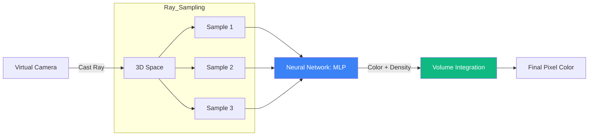

# Neural Radiance Fields (NeRF): Synthesizing 3D from 2D

**Neural Radiance Fields (NeRF)** represent a breakthrough in computer vision that uses a continuous neural function to represent a 3D scene. Unlike traditional 3D models (meshes or voxels), a NeRF stores the scene within the weights of a multilayer perceptron (MLP).

## 1. The Core Concept: Volumetric Rendering

A NeRF represents a scene as a function $F_\theta: (x, y, z, \theta, \phi) \to (c, \sigma)$:
- **Input**: A 3D location $(x, y, z)$ and a viewing direction $(\theta, \phi)$.
- **Output**: An emitted color $c = (r, g, b)$ and a volume density $\sigma$ (opacity).

To render a pixel, NeRF casts a ray through the scene, samples points along that ray, queries the MLP for their color and density, and integrates them using **Volume Rendering** equations.

## 2. Key Innovations

### A. Positional Encoding
Neural networks are biased towards learning low-frequency functions (the "spectral bias"). To capture high-frequency details (textures, sharp edges), NeRF maps the input coordinates to a higher-dimensional space using periodic functions:
$$ \gamma(p) = (\sin(2^0 \pi p), \cos(2^0 \pi p), \dots, \sin(2^{L-1} \pi p), \cos(2^{L-1} \pi p)) $$

### B. View-Dependent Effects
By including the viewing direction as an input, NeRF can model non-Lambertian effects like reflections, sheen, and specular highlights, which change depending on where you are looking from.

## 3. The NeRF Pipeline

1.  **Capture**: Take 20-100 photos of an object from different angles.
2.  **Pose Estimation**: Use COLMAP to determine the exact position and orientation of the camera for each photo.
3.  **Training**: Optimize the MLP to minimize the difference between the rendered rays and the actual pixels in the photos.
4.  **Inference**: Move a virtual camera anywhere in the scene to generate new, photorealistic views.

## 4. Limitations and Evolution

- **Speed**: Original NeRF took hours to train and seconds to render a single frame.
- **Instant-NGP**: NVIDIA's improvement using hash-grid encoding, reducing training time to seconds.
- **Mip-NeRF**: Solving aliasing issues when zooming in/out.

## Visualization: The NeRF Ray Casting

## Related Topics

[[3d-gaussian-splatting]] — the faster alternative to NeRF  
[[manifold-learning]] — geometric representation of data  
[[positional-encodings]] — the math behind coordinate mapping
---
