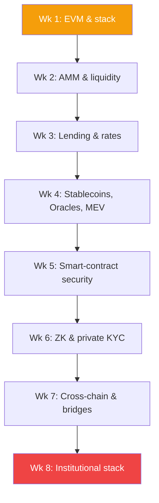

# CeDeFi Engineering — institutional Web3 in 8 weeks

A programme for engineers and quants who build hybrid systems at BlackRock / Fidelity Digital Assets scale: centralised security + decentralised liquidity. 8 weeks, 2 modules per week, each week wraps in a kata project.

## Prerequisites

- Smart contracts: Solidity at the ERC-20 / ERC-721 level, familiarity with the gas model.
- Finance: comfortable with basic derivative exposure (spot, forward, option).
- DevOps: Docker, basic Linux, Git — able to run a local Hardhat / Anvil node.

## Outcomes

By the end of the 8 weeks you can:

1. Design an end-to-end "TradFi client → on-chain yield" flow with every compliance gate wired in.
2. Explain why Curve V2 and Uniswap v3 curves optimise different metrics and when to pick which.
3. Derive the liquidation threshold for a specific Aave / Compound pool given LLTV and health factor.
4. Ship a **fully private** KYC verification flow via ZK-SNARK without leaking PII.
5. Audit a bridge contract against the OWASP + Rekt.news known-pattern checklists.

## Course map

---

## Week 1 — EVM and stack architecture

**Goal:** understand the stack from bytecode to frontend; distinguish L1 / L2 / rollup by architecture.

- [[evm-internals|EVM internals: stack, memory, storage]]
- [[gas-and-opcodes|Gas model and opcodes]]
- [[rollups-l2|Rollups and L2s (Optimism, Arbitrum, zkSync)]]
- [[data-availability|Data availability layer (Celestia, EigenDA)]]

**Kata:** ship a minimal ERC-20 without OpenZeppelin, optimise to < 30 KB bytecode, measure transfer gas vs. reference.

## Week 2 — AMM and liquidity microstructure

**Goal:** understand on-chain price discovery; see concentrated liquidity as opt-in leverage for LPs.

- [[amm-mechanics|AMM mechanics: Uniswap v2/v3, Curve]]
- [[liquidity-providers|Liquidity providers and impermanent loss]]
- [[smart-order-routing|Smart order routing]]

**Kata:** quote 5 000 USDC → ETH through Uniswap v3 TWAP quoter, compare with on-chain execution, explain the spread.

## Week 3 — Lending and risk

**Goal:** rates, liquidations, health factor; why Aave survives a crisis.

- [[lending-mechanics|Lending pool mechanics]]
- [[onchain-credit|On-chain credit score]]
- [[liquid-staking|Liquid staking (Lido, EigenLayer)]]

**Kata:** write an Aave pool simulator — supply, borrow, price shock → liquidation. Verify health-factor computation for a 3-asset position.

## Week 4 — Stablecoins, Oracles, MEV

**Goal:** the three most "breakable" layers of the DeFi stack — every serious attack passes through one of them.

- [[stablecoins|Stablecoins: USDT/USDC/DAI/crvUSD]]
- [[mev|MEV: sandwich, backrun, JIT liquidity]]
- [[oracle-design|Oracles: Chainlink, Pyth, API3]]

**Kata:** exploit a TWAP-oracle vulnerability on a mainnet fork (fork + flash loan). Explain the attack cost in gas + slippage.

## Week 5 — Smart-contract security

**Goal:** read a contract like an auditor, not like an author.

- [[contract-upgradeability|Upgradeability via proxies]]
- [[smart-contract-security|Common vulnerabilities and checklists]]
- [[formal-verification-smart|Formal verification for smart contracts]]

**Kata:** audit a Damn Vulnerable DeFi level-4+ challenge, find at least 3 vulnerabilities, write a PoC exploit.

## Week 6 — ZK and private KYC

**Goal:** the single biggest engineering revolution of 2024-2026 — proof of anything without leaking the witness.

- [[zk-kyc|Private KYC with ZK-SNARK]]
- [[privacy-defi|Private pools (Aztec, Railgun)]]
- [[account-abstraction|ERC-4337 account abstraction]]

**Kata:** write a ZK circuit (Circom / Noir) that proves "I'm > 18 and not on the sanctions list" without revealing name / DOB. Deploy to testnet.

## Week 7 — Cross-chain and bridges

**Goal:** bridges are the number-one failure point in DeFi; learn to build them safely and audit their risk.

- [[bridge-mechanics|Mechanics of bridges]]
- [[cross-chain-interop|Cross-chain interop (CCIP, LayerZero)]]
- [[onchain-perps|Cross-chain perps and vAMM]]

**Kata:** use Chainlink CCIP to send USDC + message from Ethereum to Arbitrum; handle a reorg + rollback scenario.

## Week 8 — Institutional stack

**Goal:** wire it all into a production setup a qualified custodian will sign off on.

- [[cedefi-gateway|CeDeFi gateway architecture]]
- [[cedefi|CeDeFi: stack overview]]
- [[mpc-custody|MPC custody and threshold signatures]]
- [[asset-tokenization|RWA tokenisation: real estate, bonds]]
- [[yield-aggregators|Yield aggregators and auto-compounding]]

**Kata:** spin up a local MPC wallet via `tss-lib` (3-of-5 threshold), sign a multi-party transaction, verify on-chain.

---

## Capstone project

**Compliance-yield gateway.**

Design and deploy to testnet a system that:

1. Accepts USDC from a user who has passed ZK-KYC (week 6).
2. Routes to a yield vault via Chainlink CCIP (week 7).
3. Holds operational keys under MPC threshold signatures (week 8).
4. Auto-liquidates the position if the on-chain risk score crosses a threshold (week 3).
5. Is protected against JIT / sandwich attacks via a private mempool (week 4).

Stretch: add a regulatory-reporting module — daily on-chain proof-of-reserves.

## Recommended reading

- Ethereum Yellow Paper — required for week 1.
- Antonopoulos — *Mastering Ethereum* — cover-to-cover.
- Daian et al. (2019) — *Flash Boys 2.0* — the classic MEV paper.
- Rekt.news — read every 2022-2025 post-mortem.
- Solady / Solmate — reference libraries, read the source.
- Paradigm Research — canonical research platform for AMM / MEV work.
