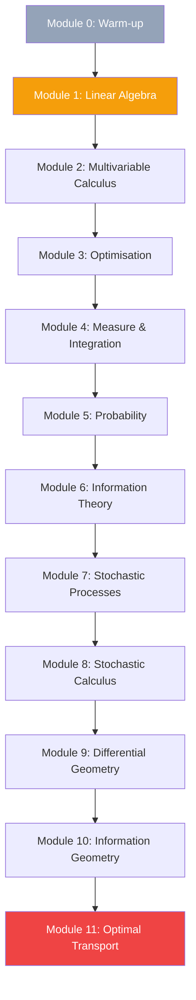

# Mathematics for Deep Learning — a PhD-grade syllabus

A **12-week** programme that takes you from linear algebra and multivariable calculus all the way to information geometry and optimal transport. Every block ends with a hands-on task tied to a modern architecture (transformers, diffusion, neural ODEs).

## Prerequisites

- Solid single-variable calculus (derivatives, integrals, series convergence).
- Basic linear algebra: matrix arithmetic, determinants, ranks.
- Working Python + NumPy (you can implement linear regression unaided).

If any of those is shaky, do **Module 0** first — it patches the gaps in one week.

## Outcomes

By the end of the course you can:

1. Read and reproduce NeurIPS / ICML papers on deep-learning theory (PAC-Bayes, NTK, diffusion, OT) without skimming the math.
2. Reason about loss-landscape geometry and why SGD prefers flat minima.
3. Derive the forward and reverse SDEs of a diffusion model from scratch.
4. Explain why natural-gradient descent is invariant to reparameterisation.
5. Numerically solve a Wasserstein problem with entropic regularisation (Sinkhorn).

## Course map

---

## Module 0 (optional, 1 week): Warm-up

Patch any gaps before the main programme.

- [[logic-sets|Set theory and logic]] — the language used everywhere later.
- [[limits-convergence|Limits and convergence]] — the bedrock of analysis.
- [[linear-spaces|Linear spaces and basis]] — moving from "matrices" to "operators".

**Checkpoint:** prove that a countable union of countable sets is countable.

---

## Week 1 — Linear algebra in operator form

**Goal:** stop seeing matrices as tables of numbers and start seeing linear operators.

- [[linear-spaces|Linear spaces, basis, dimension]]
- [[linear-systems|Linear systems & Gaussian elimination]]
- [[eigenvalues|Eigenvalues, eigenvectors, SVD]]

**Exercise:** implement low-rank SVD via power iteration from scratch and compare with `np.linalg.svd`.

## Week 2 — Spectrum, SVD, tensor decompositions

**Goal:** SVD as the universal data analysis tool, tensors as its generalisation for nets.

- [[hilbert-banach-spaces|Hilbert and Banach spaces]]
- [[tensor-decompositions|Tensor decompositions: CP, Tucker]]
- [[manifold|Manifold as a locally Euclidean object]]

**Exercise:** truncated-SVD a pre-trained ResNet layer's weights and measure accuracy degradation.

## Week 3 — Multivariable calculus

**Goal:** see backprop as the chain rule on Jacobians.

- [[multivariable-calculus|Multivariable calculus]]
- [[gradient-hessian-jacobian|Gradient, Hessian, Jacobian]]
- [[taylor-series|Taylor series as local approximation]]
- [[laplacian|The Laplacian operator]]

**Exercise:** derive the analytic gradient of softmax-cross-entropy and verify with `torch.autograd.gradcheck`.

## Week 4 — Optimisation and convexity

**Goal:** distinguish what is "easy" (convex) from what is "hard" (non-convex) in modern training.

- [[convexity|Convexity]]
- [[convex-optimization|Convex optimisation]]
- [[lagrange-multipliers|Lagrange multipliers]]
- [[linear-programming|Linear programming and duality]]

**Exercise:** derive the dual of soft-margin SVM, solve with `cvxpy`, compare with `sklearn.svm.SVC`.

## Week 5 — Measure theory and Lebesgue integral

**Goal:** the integral that survives in infinite dimensions (where DL lives).

- [[measure-theory|Measure theory basics]]
- [[lebesgue-integral|Lebesgue integral]]
- [[sigma-algebra-measurability|σ-algebras and measurability]]
- [[lp-spaces|L^p spaces]]

**Exercise:** show that MSE loss is exactly the L² norm with respect to the empirical distribution.

## Week 6 — Probability theory

**Goal:** probability as a measure, CLT as the reason normality is everywhere.

- [[kolmogorov-probability-axioms|Kolmogorov's axioms]]
- [[distributions-zoo|Zoo of distributions]]
- [[lln-clt|LLN and CLT]]
- [[multivariate-normal|Multivariate normal]]
- [[characteristic-functions|Characteristic functions]]

**Exercise:** prove the i.i.d. CLT via characteristic functions (Fourier transform of the density).

## Week 7 — Information theory

**Goal:** entropy and KL as the natural ruler for distributions and learning.

- [[information-theory|Information theory]]
- [[entropy-information|Entropy and information gain]]
- [[f-divergences|f-divergences (KL, χ², Hellinger)]]
- [[maximum-entropy|Maximum entropy principle]]

**Exercise:** show that MLE = minimisation of the forward KL between data and parameterised model.

## Week 8 — Stochastic processes

**Goal:** the language of time and uncertainty used by diffusion and neural-SDE models.

- [[discrete-markov-chains|Markov chains]]
- [[poisson-process|Poisson process]]
- [[brownian-bridge|Brownian motion and bridge]]
- [[ornstein-uhlenbeck|Ornstein–Uhlenbeck process]]
- [[martingale|Martingales]]

**Exercise:** simulate an OU trajectory via Euler–Maruyama and measure the empirical stationary distribution.

## Week 9 — Stochastic calculus

**Goal:** Itô + Langevin = backbone of modern diffusion and SGLD.

- [[stochastic-differential-equations|SDEs and the Itô integral]]
- [[feynman-kac|Feynman–Kac formula]]
- [[malliavin-calculus|Malliavin calculus]]
- [[sde-numerical-methods|Numerical methods for SDEs]]

**Exercise:** implement score-matching loss and train a score network on a 2D Gaussian mixture.

## Week 10 — Differential geometry

**Goal:** manifolds, metrics, curvature — the foundation of information geometry.

- [[differential-geometry|Differential geometry]]
- [[connections-curvature|Connections and curvature]]
- [[lie-groups|Lie groups and their algebras]]
- [[symplectic-geometry|Symplectic geometry]]
- [[hodge-theory|Hodge theory]]

**Exercise:** compute the Ricci tensor for the 2-sphere and verify it is proportional to the metric.

## Week 11 — Information geometry

**Goal:** the space of distributions as a Riemannian manifold — natural gradients, K-FAC, TRPO.

- [[fisher-information|Fisher information and FIM]]
- [[information-geometry|Information geometry]]
- [[exponential-families|Exponential families]]
- [[geometric-deep-learning|Geometric deep learning]]

**Exercise:** implement natural-gradient descent for logistic regression and compare iteration count vs. plain SGD.

## Week 12 — Optimal transport

**Goal:** Wasserstein distance as the geometry between distributions, the engine behind diffusion and flow matching.

- [[optimal-transport|Optimal transport]]
- [[manifold-learning|Manifold learning]]
- [[ricci-flow|Ricci flow]]

**Exercise:** implement Sinkhorn for entropic OT and apply it to a domain-adaptation problem.

---

## Capstone project

**Information bottleneck inside a transformer.**

Using tools from Week 7 (information theory) and Week 11 (information geometry), measure the mutual information between intermediate BERT-base activations and (a) the input, (b) the output target. Plot the IB-plane curve per layer and locate the *memorisation → compression* phase transition.

Stretch goal: repeat with DistilBERT and compare how much earlier the phase transition arrives.

## Recommended reading

- Strang, G. — *Linear Algebra and Learning from Data* (Modules 1-2).
- Boyd & Vandenberghe — *Convex Optimization* (Module 3).
- Cover & Thomas — *Elements of Information Theory* (Module 6).
- Øksendal — *Stochastic Differential Equations* (Modules 7-8).
- Amari — *Information Geometry and Its Applications* (Module 10).
- Peyré & Cuturi — *Computational Optimal Transport* (Module 11).
