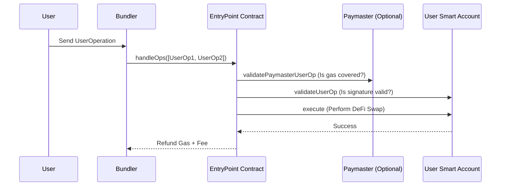

# Account Abstraction (ERC-4337): The Modular Wallet Standard

**Account Abstraction (AA)** is a transformative upgrade to the Ethereum ecosystem that decouples the object that holds assets (the account) from the object that initiates transactions (the signer). This turns wallets into programmable smart contracts, enabling a user experience identical to traditional banking apps without sacrificing self-custody.

## 1. The ERC-4337 State Machine

Unlike previous attempts at AA, ERC-4337 does not require a hard fork. It introduces a separate transaction flow via a global singleton contract called the **EntryPoint**.

### Step-by-Step Execution:
1.  **UserOperation**: Instead of a standard TX, the user signs a `UserOperation` object. This includes `callData`, `nonce`, and custom fields for gas payment.
2.  **Bundler**: Specialized nodes collect `UserOperations` from an alternative mempool. They group multiple operations into a single standard Ethereum transaction.
3.  **Validation Loop**: The EntryPoint calls `validateUserOp` on the user's Smart Account. If the signature is valid and gas is covered, the transaction proceeds.
4.  **Execution Loop**: The EntryPoint calls the account's execution logic to interact with DeFi protocols (e.g., Uniswap).

## 2. Advanced Paymaster Mechanics

The **Paymaster** is a contract that can "sponsor" gas fees. This is critical for CeDeFi user acquisition:
- **Gasless Onboarding**: Your project's treasury pays for the first 10 transactions of a new user.
- **ERC-20 Gas Payment**: Users pay for gas in USDC or your project's native token instead of ETH. The Paymaster accepts the USDC and pays the EntryPoint in ETH.

## 3. Session Keys and Security Policies

Smart accounts allow for **Granular Permissioning**, which is essential for institutional traders:
- **Session Keys**: A trader can authorize an algorithmic bot to trade up to $10,000 in volume for the next 24 hours. The bot uses a temporary key; if compromised, the damage is limited by the policy.
- **Native Multi-sig**: The account logic can require $M$-of-$N$ signatures for any withdrawal above a certain threshold, all without the gas overhead of a Gnosis Safe multi-sig.

## 4. Engineering Trade-offs

1.  **Deployment Cost**: A smart account must be "deployed" on its first transaction, costing more gas than a standard EOA setup.
2.  **Execution Overhead**: Every AA transaction has ~30-50k additional gas overhead due to the EntryPoint and Validation logic.
3.  **Signature Aggregation**: To reduce costs, multiple `UserOperations` can have their signatures aggregated (using BLS signatures) into a single proof, significantly lowering per-user costs in high-traffic environments.

## Visualization: The ERC-4337 Flow

## Related Topics

[[cedefi-gateway-architecture]] — managing Bundlers and Paymasters  
[[zk-kyc]] — automating identity checks within the validation loop  
[[smart-contract-upgradeability]] — making the smart account logic patchable
---
