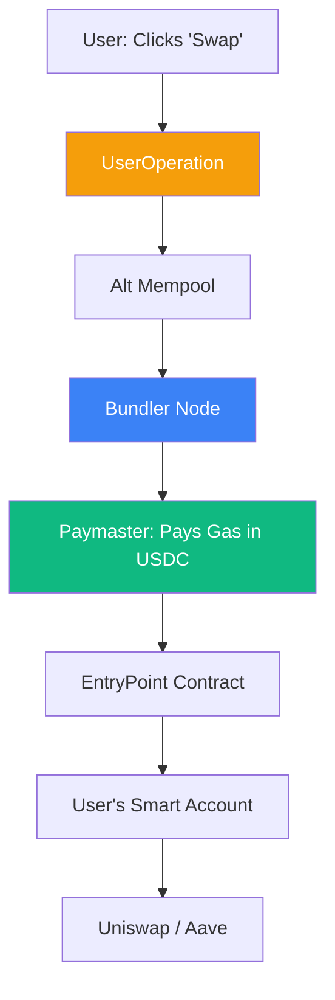

# Account Abstraction (ERC-4337): The UX Revolution

To bring the next billion users and institutional capital to DeFi, we must solve the "Wallet Problem." Traditional wallets (EOAs like Metamask) are difficult to use and easy to lose. **Account Abstraction (AA)** turns every user's wallet into a **Smart Contract**, enabling features that mimic modern banking apps while remaining decentralized.

## 1. EOA vs. Smart Accounts

- **EOA (Externally Owned Account)**: A public/private key pair. If you lose the key, you lose the funds. You must pay gas in the native token (e.g., ETH).
- **Smart Account (AA)**: A programmable contract. Logic can define how transactions are signed, paid for, and recovered.

## 2. Key Components of ERC-4337

ERC-4337 implements AA without changing the core Ethereum protocol:
1.  **UserOperations**: Pseudo-transaction objects that describe the user's intent.
2.  **Bundlers**: Specialized nodes that collect `UserOperations` from a separate mempool and package them into a single standard transaction.
3.  **Paymasters**: Contracts that can pay for gas on behalf of the user. This enables **Gasless Transactions** or paying gas in USDC.
4.  **EntryPoint**: A global singleton contract that verifies and executes all smart account transactions.

## 3. Features for CeDeFi Projects

If your project integrates Account Abstraction, you can offer:

### A. Social Recovery
Instead of a seed phrase, a user can designate "Guardians" (friends, or your platform's backend). If a device is lost, guardians can sign a transaction to reset the user's key.

### B. Transaction Batching
Combine "Approve" and "Swap" into a single click. In standard DeFi, these are two separate transactions; with AA, they happen atomically.

### C. Session Keys
Allow a trading bot to execute trades on behalf of the user for a limited time or within a specific volume limit, without the user having to sign every single trade.

### D. Native Multi-sig
Institutions can require 3 out of 5 internal signatures before any fund withdrawal is even sent to the blockchain, all within a single account.

## 4. Security Implications

While AA improves UX, it introduces new risks:
- **Contract Risk**: A bug in the Smart Account contract can lead to loss of funds.
- **Paymaster Reliability**: If your project's Paymaster runs out of funds, your users cannot execute transactions.

## Visualization: The AA Transaction Flow

## Related Topics

[[cedefi-gateway-architecture]] — integrating AA into the gateway  
[[zk-kyc]] — using AA to automatically verify ZK-proofs  
[[stablecoin-mechanisms]] — paying gas with stablecoins via Paymasters
---
