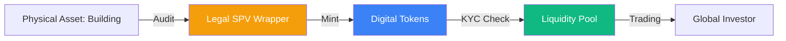

# Real World Asset (RWA) Tokenization

**Asset Tokenization** is the process of converting ownership rights of a physical or financial asset into a digital token on a blockchain. By bringing **Real World Assets (RWA)** like real estate, private equity, or government bonds on-chain, financial institutions aim to eliminate the inefficiencies of legacy settlement systems and unlock global liquidity.

## 1. The Architecture of Tokenization

To bridge the gap between the physical and digital worlds, a robust legal and technical framework is required:

### A. The Legal Wrapper (SPV)
Most RWA projects use a **Special Purpose Vehicle (SPV)**. 
1. The physical asset is owned by the SPV (a legal entity).
2. The tokens represent fractional shares or debt obligations of that SPV.
3. This ensures that if the token issuer goes bankrupt, the underlying asset is legally ring-fenced and belongs to the token holders.

### B. Standards (ERC-3643 and ERC-1400)
Unlike standard utility tokens, security tokens must enforce compliance. Standard **ERC-3643** (T-REX) includes:
- **Identity Registry**: Tokens cannot be transferred to addresses that haven't cleared KYC.
- **Compliance Rules**: Rules about investor limits (e.g., max 99 investors) or regional restrictions are hard-coded.

### C. The Oracle Problem
How does the blockchain know the real-world value of a building or a gold bar?
- **Proof of Reserve (PoR)**: Third-party auditors (like Chainlink or specialized firms) provide real-time data feeds confirming that the physical assets still exist and match the token supply.

## 2. Strategic Benefits

### A. Atomic Settlement
In traditional finance (TradFi), settling a trade for a private house or a bond can take days (T+2 or T+5). On-chain, the exchange of the asset for payment happens **atomically** in seconds. This eliminates **Counterparty Risk**.

### B. Fractional Ownership
A $100 million office building can be split into 1 million tokens worth $100 each. This democratizes access to high-yield investments that were previously restricted to billionaire "accredited investors."

### C. Liquidity for Illiquid Assets
Tokens can be traded on [[amm-mechanics|Automated Market Makers]] 24/7. An investor can sell a fraction of their real estate stake at 3 AM on a Sunday, a feat impossible in the physical world.

## 3. Institutional Use Cases

1.  **Tokenized Treasuries**: Projects like BlackRock's **BUIDL** or Franklin Templeton's **FOBXX** bring US Government Bonds on-chain, allowing DeFi protocols to earn risk-free yield.
2.  **Private Credit**: Platforms like Centrifuge allow small businesses to borrow money directly from global liquidity pools using their invoices or property as collateral.
3.  **Commodities**: Tokenized gold (PAXG) allows for instant global transfer of bullion value without physical shipping costs.

## 4. Risks and the "Off-chain Coupling" Problem

- **Legal Enforceability**: If a hacker steals your tokens, can you still claim the physical house in a local court? Many jurisdictions do not yet recognize blockchain records as primary proof of ownership.
- **Centralization**: Because RWA relies on an SPV and a custodian, it is not "trustless." You must trust that the legal entity and the physical vault actually exist.
- **Oracle Manipulation**: False data from a physical auditor can lead to the mispricing of tokens, causing systemic risk in [[cedefi-mechanics|CeDeFi]] protocols.

## Visualization: The Tokenization Lifecycle

## Related Topics

[[amm-mechanics]] — the trading engine for tokens  
[[cedefi-mechanics]] — the regulatory environment for RWA  
[[smart-order-routing]] — moving between tokenized and legacy assets
---
