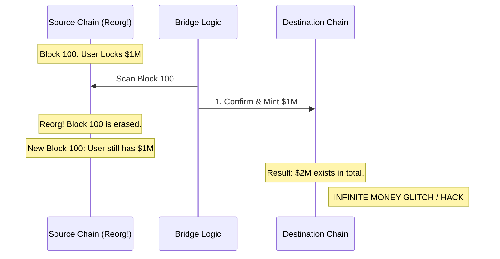

# Bridge Security and Settlement Finality

For any **CeDeFi** project that operates across multiple blockchains (e.g., using Ethereum for security and Arbitrum for low-cost trading), **Bridges** are the most critical and vulnerable component. Understanding the trade-off between speed and security, and the concept of **Settlement Finality**, is essential for preventing catastrophic loss of funds.

## 1. The Core Risk: The Bridge as a Vault

A bridge is essentially a giant vault. When you move 100 USDC from Chain A to Chain B:
1.  The bridge **Locks** (or burns) 100 USDC on Chain A.
2.  The bridge **Mints** (or unlocks) 100 "Wrapped" USDC on Chain B.

If a hacker finds a bug in the bridge's code and can trick Chain B into minting tokens without locking them on Chain A, they can drain the entire liquidity of your project. This is how billions have been stolen in hacks like Poly Network and Ronin.

## 2. Types of Bridge Security

### A. Trusted (Centralized) Bridges
Rely on a set of external validators or a single entity to confirm transactions.
- **Pros**: Fast, low gas costs.
- **Cons**: You must trust the validators not to collude and steal the funds.
- **CeDeFi use case**: Regulated institutions often prefer trusted bridges managed by licensed custodians.

### B. Trustless (Decentralized) Bridges
Rely on mathematical proofs (e.g., ZK-proofs or Light Clients) to verify state.
- **Pros**: Highest security; no human can steal the funds.
- **Cons**: High technical complexity and higher gas costs.

## 3. The Finality Problem

**Settlement Finality** is the moment when a transaction can no longer be reversed or "reorged" by the network.
- **Instant Finality**: Common in PoS chains like Cosmos or BSC. Once a block is added, it's final.
- **Probabilistic Finality**: Common in Ethereum and Bitcoin. You must wait for $N$ blocks (confirmations) to be sure the transaction won't disappear.

### The Attack Scenario
If your bridge is too "fast" and confirms a deposit on Chain B after only 1 block on Chain A, a **Blockchain Reorg** on Chain A could erase that deposit. The user would have their tokens on Chain B, but the "locked" collateral on Chain A would have vanished. 

## 4. Implementation for Your Project

To ensure institutional-grade security:
1.  **Safety Buffer**: Always wait for a safe number of confirmations (e.g., "Finalized" state in Ethereum) before triggering the minting process on the target chain.
2.  **Rate Limiting**: Implement a daily limit on how many assets can move through the bridge. If a hack starts, the damage is capped.
3.  **Hash Time-Lock Contracts (HTLC)**: Use atomic swaps where the user and the bridge must both provide a secret to unlock funds, ensuring the swap happens on both chains or neither.

## Visualization: The Reorg Risk

## Related Topics

[[cedefi-gateway-architecture]] — the off-chain part of the bridge  
[[asset-tokenization]] — ensuring RWA tokens remain pegged during bridging  
[[stablecoin-mechanisms]] — risks of de-pegging in wrapped stablecoins
---
