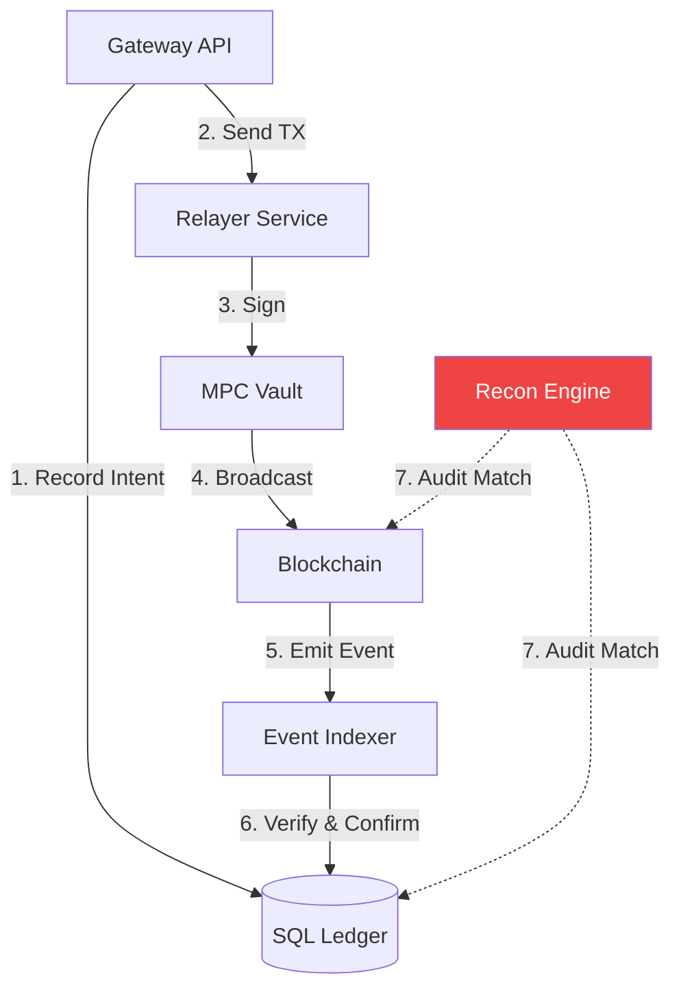

# CeDeFi Gateway Architecture: High-Performance Institutional Bridging

Building a **CeDeFi Gateway** is an exercise in distributed systems engineering. The goal is to provide institutional clients with sub-second execution speeds on the frontend while maintaining 100% data integrity with the asynchronous, high-latency environment of the blockchain.

## 1. The Transaction Management Layer (Relayer)

The Relayer is the most complex service in the gateway. It must handle:

### A. Nonce Management and Concurrency
In Ethereum, transactions from a single address must have sequential nonces. In a high-traffic gateway, multiple transactions are sent simultaneously.
- **The Problem**: If TX #5 fails, TX #6 and #7 will be blocked.
- **The Solution**: Use a **Nonce Queue** in Redis. If a transaction is stuck, the Relayer must automatically send a "replacement" transaction with a higher gas fee and the same nonce to clear the pipe.

### B. Dynamic Gas Strategies
Institutions cannot afford "stuck" transactions. The Relayer implements:
- **EIP-1559 Support**: Splitting fees into `maxFeePerGas` and `maxPriorityFeePerGas`.
- **Exponential Bump**: If a TX is not mined within 3 blocks, increase the priority fee by 20% and resubmit.

## 2. The Indexer and Reconciliation (Data Integrity)

The SQL database must always match the blockchain state.
- **Event Logs**: The Indexer listens for `Deposit` and `Withdrawal` events.
- **Reconciliation Engine**: A background cron-job that runs every hour, comparing the sum of balances in the SQL `Ledger` table with the result of the `balanceOf` function in the smart contract.
- **Drift Detection**: If a discrepancy > 0.000001 is found, the system triggers an emergency alert and pauses withdrawals.

## 3. Custody Architecture: MPC vs. Multi-sig

- **MPC (Multi-Party Computation)**: Best for high-frequency operations. Keys are never reconstructed in one place. Using threshold signatures (TSS), the gateway can sign transactions faster and with lower gas than an on-chain multi-sig.
- **Cold Storage Interaction**: High-value transactions (e.g., > $1M) should require an offline signature from a hardware security module (HSM) located in a physically secure vault.

## 4. Operational Resilience: Circuit Breakers

A professional gateway must have "Off-switches":
1.  **Global Pause**: Stops all contract interactions.
2.  **Rate Limiter**: Limits the total USD value that can be withdrawn in a 24-hour window.
3.  **Blacklist**: Real-time integration with Chainlink's Sanctions Oracle to block addresses associated with OFAC-sanctioned entities.

## Visualization: The "Double-Check" Architecture

## Implementation Tip: Idempotency
Every API call to the gateway must include a `request_id`. If the Relayer crashes after sending a transaction but before recording it in SQL, the `request_id` ensures that a retry doesn't send the same money twice (**Double Spend Protection**).

## Related Topics

[[cedefi-mechanics]] — the regulatory context  
[[bridge-security]] — risks when moving between chains  
[[zk-kyc]] — identifying users before they hit the gateway
---
