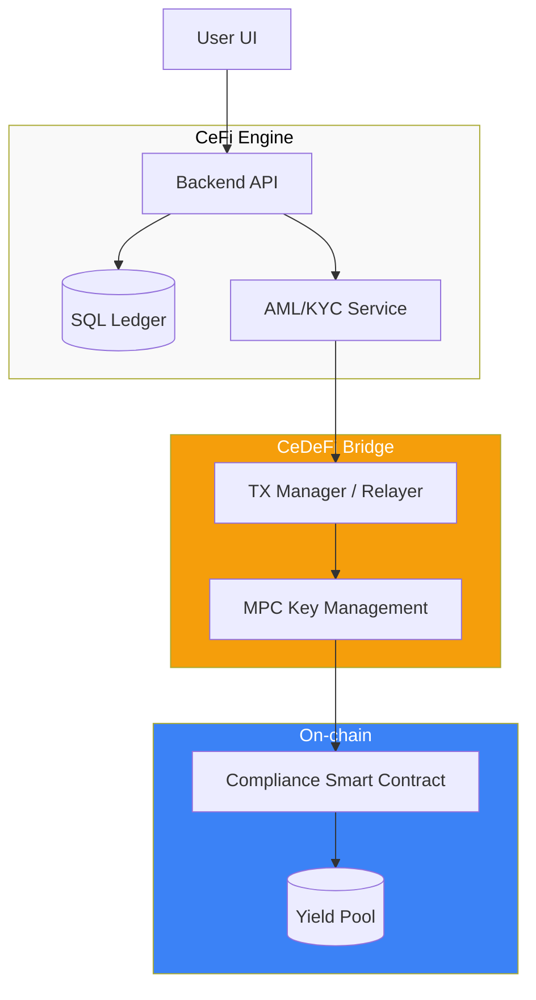

# CeDeFi Gateway Architecture: Engineering the Bridge

To build a professional CeDeFi project, one must solve the challenge of connecting a centralized, high-performance financial system (off-chain) with a decentralized, asynchronous blockchain environment (on-chain). A standard **CeDeFi Gateway** consists of four critical layers.

## 1. The Custody Layer (Asset Security)

The most sensitive part of the architecture. Institutions cannot store private keys in plain text on a server.
- **MPC (Multi-Party Computation)**: Instead of a single private key, the key is split into "shards" distributed across multiple servers (e.g., Fireblocks or Fordefi). No single party can sign a transaction alone.
- **Hierarchical Deterministic (HD) Wallets**: Generating a unique deposit address for every user to simplify tracking and AML checks.

## 2. The Relayer and Transaction Manager

Blockchain transactions can fail due to gas price spikes or network congestion. The **Relayer** acts as a buffer:
- **Nonce Management**: Ensuring transactions are sent in the correct order even if the backend is highly parallelized.
- **Dynamic Gas Estimator**: Using real-time data to "bump" gas fees so that institutional withdrawals aren't stuck for hours.
- **Event Listener**: A service that monitors the blockchain for `Transfer` or `Deposit` events to update the internal SQL database in real-time.

## 3. The Smart Contract Middleware (Compliance Layer)

This is the code that lives on-chain but enforces centralized rules.
- **Identity Registry**: Before a user can interact with your pool, the backend must "tag" their wallet address on-chain as verified.
- **Circuit Breakers**: A master key (held in multi-sig) that can pause the contract in case of a detected hack or a massive price manipulation event.
- **Atomic Settlement**: Ensuring that the "Lock" on the CeFi side and the "Mint" on the DeFi side happen simultaneously or not at all.

## 4. The API and Order Execution Layer

This layer translates REST/gRPC calls from your frontend into Web3 transactions.
- **Liquidity Aggregation**: The gateway must decide where to execute a trade. Should it go to a centralized exchange (Binance) or an on-chain pool (Uniswap)?
- **Slippage Protection**: Calculating the maximum allowed price impact before the transaction is even sent to the mempool.

## Visualization: System Design

## Implementation Tip for Your Project
Use a **Message Queue** (like RabbitMQ or Kafka) between your API and the Relayer. This prevents losing transactions if the blockchain node goes down or if there is a sudden spike in user activity.

## Related Topics

[[cedefi-mechanics]] — the high-level concept  
[[amm-mechanics]] — the on-chain destination  
[[stablecoin-mechanisms]] — the primary medium of exchange
---
