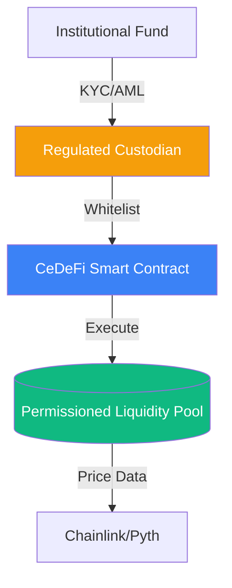

# CeDeFi: The Convergence of Institutional and Decentralized Finance

**CeDeFi** (Centralized-Decentralized Finance) is a hybrid financial model that combines the innovative yield-generating protocols of [[amm-mechanics|DeFi]] with the regulatory compliance and security of traditional Centralized Finance (CeFi). It is the primary vehicle through which institutional capital (hedge funds, banks) enters the blockchain ecosystem.

## 1. The Core Paradox

Institutional players (like Citadel or Goldman Sachs) face a paradox:
- **DeFi Opportunity**: 24/7 liquidity, transparency, and high yields from automated lending and market making.
- **CeFi Constraint**: Legal requirements for **KYC** (Know Your Customer) and **AML** (Anti-Money Laundering). Standard DeFi is permissionless and anonymous, making it legally toxic for regulated funds.

CeDeFi solves this by creating **Permissioned Environments** on top of decentralized protocols.

## 2. Technical Architectures

### A. Permissioned Liquidity Pools
In a standard Uniswap pool, anyone can be a Liquidity Provider (LP). In CeDeFi (e.g., **Aave Arc**), the smart contract includes a "Whitelist" filter.
- Users must prove their identity to a regulated gatekeeper.
- Only verified "Allow-listed" addresses can deposit funds.
- This creates a "clean" ecosystem where institutions trade only with other known, audited entities.

### B. Enterprise Blockchains and Layer 2s
Many CeDeFi projects operate on centralized or semi-centralized networks like **Binance Smart Chain (BSC)** or exchange-backed Layer 2s like **Coinbase's Base**. These networks offer:
- **Low Latency**: Faster than Ethereum L1, approaching the speeds required for high-frequency trading (HFT).
- **Control**: The ability to freeze funds or reverse transactions in the event of a major hack or regulatory order.

## 3. Compliance as Code

CeDeFi implements regulatory rules directly into the smart contract logic:
- **Regional Restrictions**: Automatically blocking IP addresses from specific jurisdictions.
- **Transaction Limits**: Enforcing maximum trade sizes to prevent market manipulation.
- **Sanction Screening**: Real-time checking of addresses against global sanction lists (OFAC) before allowing an interaction.

## 4. Risks and Trade-offs

1.  **Centralization Risk**: By introducing gatekeepers, CeDeFi loses the "censorship resistance" that is the hallmark of true DeFi.
2.  **Oracle Vulnerability**: CeDeFi protocols still rely on external [[amm-mechanics|Price Oracles]]. If an oracle is manipulated, even a "compliant" pool can be drained.
3.  **Bridge Risk**: Moving institutional capital between chains requires **Bridges**. These are the weakest links in the ecosystem and have been the target of the largest hacks in crypto history.

## Visualization: The Hybrid Stack

## Related Topics

[[amm-mechanics]] — the underlying liquidity math  
[[smart-order-routing]] — how funds move between CeFi and DeFi  
risk-management — institutional frameworks for CeDeFi exposure
---
