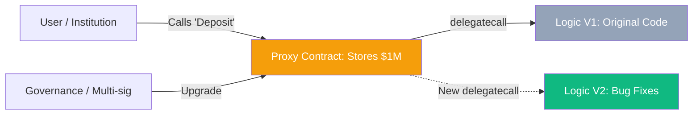

# Smart Contract Upgradeability: Balancing Immutability and Flexibility

The mantra of blockchain is "Code is Law," and standard smart contracts are immutable (unchangeable). However, for an institutional **CeDeFi** project, absolute immutability is a liability. You need the ability to fix critical bugs, patch security vulnerabilities, or update logic to comply with new regulations. **Upgradeability Patterns** provide a way to change code while keeping the state (balances, user data) intact.

## 1. The Proxy Pattern: Logic vs. Storage

The standard way to make a contract upgradeable is to split it into two separate parts:

1.  **The Proxy Contract**: This is the address users interact with. It holds all the **Storage** (balances, variables) but contains no business logic.
2.  **The Implementation Contract**: This contains the **Logic** (the functions). 

When a user calls a function on the Proxy, the Proxy uses a low-level EVM instruction called `delegatecall` to execute the logic sitting in the Implementation contract, but updates the storage *inside the Proxy*.

## 2. Major Upgrade Patterns

### A. Transparent Proxy Pattern
- **Logic**: Separates user calls from admin calls.
- **Benefit**: Prevents "Function Selector Clashes" where an admin function might accidentally overlap with a user function.
- **Drawback**: High gas cost for every transaction because the contract must check `msg.sender` on every call.

### B. UUPS (Universal Upgradeable Proxy Standard)
- **Logic**: The upgrade logic is placed inside the Implementation contract itself, not the Proxy.
- **Benefit**: Much cheaper in terms of gas. This is the **current industry standard** recommended by OpenZeppelin.
- **Drawback**: If you deploy an Implementation contract without the upgrade function, you "brick" the proxy—it can never be upgraded again.

## 3. Storage Collisions: The Silent Killer

The biggest technical risk in upgradeability is a **Storage Collision**. 
In the EVM, variables are stored in numbered "slots." If your first version has `uint a` in Slot 0, and your second version adds `uint b` at the beginning, `b` will overwrite the data of `a`. 
- **Rule**: Never change the order of existing variables. Only add new variables at the end of the storage layout.

## 4. Governance and Trust

Institutions need to know that you (the developer) cannot unilaterally change the code to steal their funds.
1.  **Multi-sig Wallets**: The "Admin" of the proxy should be a **Gnosis Safe** (multi-sig) held by 3-5 trusted parties.
2.  **Timelocks**: Any upgrade must be announced 48-72 hours in advance. A **Timelock Contract** sits between the admin and the proxy, giving users time to withdraw their funds if they don't like the upcoming change.

## 5. Implementation for Your Project

1.  Use **OpenZeppelin Upgrades** library to handle the complexities of UUPS.
2.  Use **Hardhat/Foundry Upgrades Plugin** to automatically check for storage collisions before deployment.
3.  Implement an **Emergency Pause** (Circuit Breaker) that is NOT upgradeable, allowing you to stop the system instantly if a bug is found.

## Visualization: The Proxy Flow

## Related Topics

[[cedefi-gateway-architecture]] — managing the admin keys off-chain  
[[mev]] — risks of front-running upgrade transactions  
[[risk-management]] — technical risk assessment of proxy patterns
---
