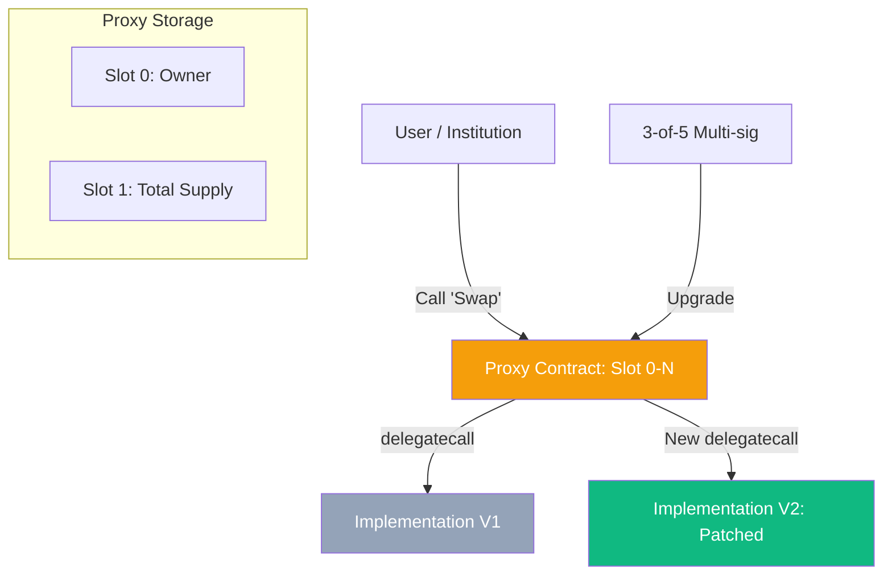

# Smart Contract Upgradeability: Patterns, Risks, and Storage Layout

While the immutability of blockchain is a core security feature, institutional-grade **CeDeFi** projects require the ability to patch bugs and comply with evolving regulations. **Upgradeability Patterns** use the EVM's `delegatecall` instruction to change code logic while preserving state (balances, user data).

## 1. The Mechanics of Delegatecall

When Contract A executes `delegatecall` to Contract B:
- The code from B is executed.
- The **Storage**, **Balance**, and **Address** remain those of Contract A.
This allows us to split a system into a permanent **Proxy** (Storage) and a replaceable **Implementation** (Logic).

## 2. Advanced Upgrade Patterns

### A. UUPS (Universal Upgradeable Proxy Standard)
Pioneered by EIP-1822, this is the modern standard for CeDeFi.
- **Logic**: The code to upgrade the contract is located *within the implementation* itself.
- **Security**: If you forget to include the upgrade function in a new implementation, the contract becomes immutable forever (it is "bricked").
- **Gas**: Extremely efficient, as the proxy does not need to check the admin's address on every call.

### B. Transparent Proxy Pattern
- **Logic**: The upgrade logic sits in the Proxy.
- **Security**: It uses an "Admin" check on every transaction. If the caller is the Admin, they can only call the upgrade functions. If the caller is a User, they can only call business logic.
- **Drawback**: High gas overhead (~1000-2000 gas per TX) due to frequent storage reads of the admin address.

## 3. The Initialization Paradox

Smart contracts using proxies **cannot use constructors**. 
- **The Problem**: A constructor runs only once during the implementation's deployment, updating the *implementation's* storage, not the *proxy's*.
- **The Fix**: Use an `initialize()` function with an `initializer` modifier from OpenZeppelin. This ensures the function can only be called once, setting up the proxy's initial state (e.g., setting the owner).

## 4. Storage Collisions: The Technical Nightmare

The EVM identifies variables by their index (Slot 0, Slot 1, etc.).
- **V1 Layout**: `address owner` (Slot 0), `uint balance` (Slot 1).
- **Broken V2 Layout**: `uint version` (Slot 0), `address owner` (Slot 1).
In this scenario, the `version` variable would overwrite the `owner`'s data, leading to total protocol failure.
- **Mitigation**: Use **Storage Gaps** (reserved empty slots) or automated auditing tools like `openzeppelin-upgrades` to verify that the storage layout of the new implementation is compatible with the old one.

## 5. Multi-sig and Timelock Governance

For CeDeFi, an upgrade should never be unilateral.
1.  **Multi-sig**: The "Proposer" is a 3-of-5 multisig of the project's lead engineers.
2.  **Timelock**: Once a proposal is signed, it enters a 48-hour **Timelock**. This delay allows the market to audit the new code and gives users time to withdraw funds if they disagree with the change.

## Visualization: UUPS Architecture

## Related Topics

[[cedefi-gateway-architecture]] — managing the admin keys  
[[mev]] — front-running upgrade transactions  
risk-management — evaluating proxy-related vulnerabilities
---
