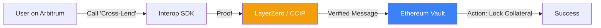

# Cross-chain Interoperability Protocols: Beyond Bridges

While standard [[bridge-security|Bridges]] move assets between chains, **Cross-chain Interoperability Protocols** (e.g., **LayerZero**, **Chainlink CCIP**, **Wormhole**) allow for the transfer of **arbitrary data and logic**. This enables "Omnichain" applications where a user can deposit collateral on Ethereum and open a leveraged position on Arbitrum in a single click.

## 1. Messaging vs. Bridging

- **Bridging**: "Lock asset on Chain A, mint copy on Chain B."
- **Messaging**: "Execute function `X` on Chain B based on the event that happened on Chain A."
Interoperability protocols provide the infrastructure to prove that an event actually happened on the source chain without requiring the destination chain to store the entire history of the source.

## 2. Key Architectures

### A. LayerZero: Ultra Light Nodes
LayerZero uses an **Oracle** and a **Relayer** to achieve trustless communication.
1.  The Oracle sends the block header from Chain A to Chain B.
2.  The Relayer sends the transaction proof.
3.  If both match, Chain B confirms the message.
- **Benefit**: Extremely gas-efficient as the destination chain doesn't need to run a full light client.

### B. Chainlink CCIP: Risk Management Network
CCIP adds an extra layer of security called the **Risk Management Network**. 
- A separate set of nodes monitors the cross-chain messages for any sign of corruption or hacks.
- If the Risk Management Network detects an anomaly, it can pause all cross-chain traffic instantly.

## 3. Use Cases for CeDeFi

1.  **Unified Liquidity**: A project can have a single liquidity pool shared across 10 different chains. No more fragmented "wrapped" tokens.
2.  **Cross-chain Governance**: A DAO can vote on Ethereum to change parameters of a vault living on Polygon.
3.  **Omnichain Lending**: Borrowing against tokenized real estate ([[asset-tokenization|RWA]]) on an institutional-focused L2, while using the borrowed stablecoins on Ethereum mainnet.

## 4. The "Trust Assumption" Risk

Interoperability protocols introduce a new security layer. If the underlying messaging protocol is compromised, all connected chains are at risk.
- **Solution**: For your project, use **Defense-in-Depth**. Do not rely on one protocol; require confirmation from both LayerZero and CCIP for high-value transactions.

## Visualization: Omnichain Logic Flow

## Related Topics

[[bridge-security]] — the security foundation  
[[cedefi-gateway-architecture]] — how to integrate interop into the backend  
[[smart-order-routing]] — routing across multiple chains
---
