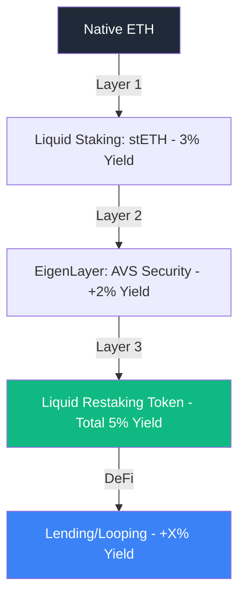

# Liquid Staking and Restaking: The Yield Layer

Liquid Staking and Restaking have become the bedrock of the decentralized economy, providing a way to secure networks while keeping capital productive. These protocols (like **Lido** and **EigenLayer**) create a "Bond Market" for the blockchain, allowing users to earn multiple layers of yield on the same underlying asset.

## 1. Liquid Staking Tokens (LSTs)

In Proof-of-Stake (PoS) networks like Ethereum, "staking" traditionally requires locking up assets, making them illiquid. **Liquid Staking** (e.g., Lido's **stETH**) solves this:
1.  **Deposit**: User deposits ETH into a protocol.
2.  **Receipt**: The protocol issues an LST (like stETH) representing the user's claim on the ETH + rewards.
3.  **Productivity**: The stETH can be used as collateral in [[amm-mechanics|DeFi]] (e.g., to mint [[stablecoin-mechanisms|stablecoins]]), effectively allowing the user to be in two places at once.

## 2. The EigenLayer Revolution: Restaking

**Restaking**, introduced by EigenLayer (2023), takes this a step further by allowing the same staked ETH to secure **multiple services** simultaneously (Actively Validated Services, or AVSs).

### A. Shared Security
Instead of every new project (like a decentralized bridge or an oracle) having to build its own security network from scratch, they can "rent" the massive security of Ethereum. 
Restakers commit their LSTs to secure these AVSs in exchange for extra yield.

### B. Slashing Risks
The trade-off for higher yield is higher risk. If a restaker secures 10 different services and fails in one, they could potentially lose their capital across all of them. This creates a **complex correlation of risk** that is difficult to model.

## 3. Liquid Restaking Tokens (LRTs)

LRTs (like **ether.fi** or **Renzo**) add another layer of abstraction. They manage the restaking strategy for the user, automatically choosing which AVSs to secure and issuing a liquid token representing the total "stacked" yield.

## 4. Institutional Implications: The "Internet Bond"

For funds like Citadel, LSTs and LRTs are the digital equivalent of **Treasury Bills**. 
- They provide a "Risk-Free Rate" of the network.
- They can be used in repo-like markets to manage liquidity.
- **The Systemic Risk**: If a bug is found in a major LST contract (like stETH), billions of dollars of collateral across the entire DeFi ecosystem could collapse simultaneously.

## Visualization: The Yield Pyramid

*Each layer adds yield, but also increases the technical and systemic risk of the stack.*

## Related Topics

[[amm-mechanics]] — where LSTs are traded  
[[stablecoin-mechanisms]] — using staked assets as collateral  
[[risk-management]] — modeling the cascading failures of restaking
---
