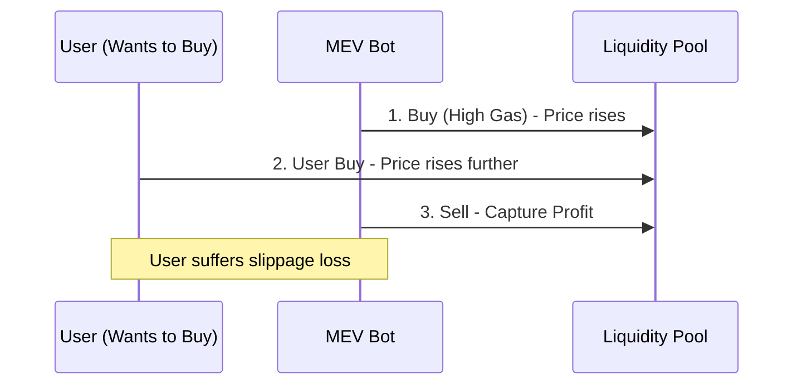

# Maximal Extractable Value (MEV)

**Maximal Extractable Value (MEV)** is the maximum value that can be extracted from block production over and above the standard block reward and gas fees. This is achieved by including, excluding, and **reordering** transactions within a block. In the world of high-finance, MEV is the blockchain equivalent of **High-Frequency Trading (HFT) and Front-Running**.

## 1. The "Dark Forest" Mechanism

In a decentralized network, transactions wait in a public area called the **Mempool** before being added to a block. MEV bots constantly scan the mempool for profitable opportunities.

### A. Front-running
If a bot sees a large buy order for a token on an [[amm-mechanics|AMM]], it sends its own buy order with a higher gas fee. Its trade is processed first, pushing the price up. The original user buys at a higher price, and the bot immediately sells for a profit.

### B. Sandwich Attacks
The bot places an order both *before* and *after* a user's transaction. 
1.  **Buy** before the user (pushing price up).
2.  User **Buys** (pushing price higher).
3.  **Sell** after the user.
The user pays the maximum "Slippage," and the bot captures the difference.

### C. Arbitrage
If the price of ETH is \$3000 on Uniswap but \$3005 on SushiSwap, an MEV bot will execute a cross-protocol trade in a single atomic transaction to capture the \$5 difference.

## 2. The Proposer-Builder Separation (PBS)

To prevent a few large miners/validators from monopolizing MEV, the ecosystem has moved toward **PBS**:
- **Builders**: Specialized entities that compete to build the most profitable block using complex optimization algorithms.
- **Proposers (Validators)**: They simply pick the most profitable block provided by the builders.
- **Flashbots**: A middleware (MEV-Boost) that creates a private communication channel between searchers and validators to prevent the "gas wars" that clog the network.

## 3. MEV as an Institutional Risk

For institutional traders like Citadel, MEV is a significant cost.
1.  **Implementation Shortfall**: MEV increases the "effective spread" and slippage of large trades.
2.  **Information Leakage**: Since orders sit in the mempool, competitors can see your intentions before they are executed.
3.  **Solution**: Institutions use **Private RPCs** (e.g., Flashbots Protect) that bypass the public mempool and send orders directly to trusted builders, guaranteeing they won't be "sandwiched."

## 4. Toxic vs. Non-Toxic MEV

- **Non-Toxic**: Arbitrage (aligns prices across venues) and Liquidations (keeps debt protocols healthy).
- **Toxic**: Sandwich attacks and front-running (direct wealth transfer from users to bot operators).

## Visualization: The Sandwich Attack

## Related Topics

[[amm-mechanics]] — the target for MEV attacks  
[[smart-order-routing]] — defending against MEV by splitting orders  
[[latency-arbitrage]] — the HFT predecessor to MEV
---
