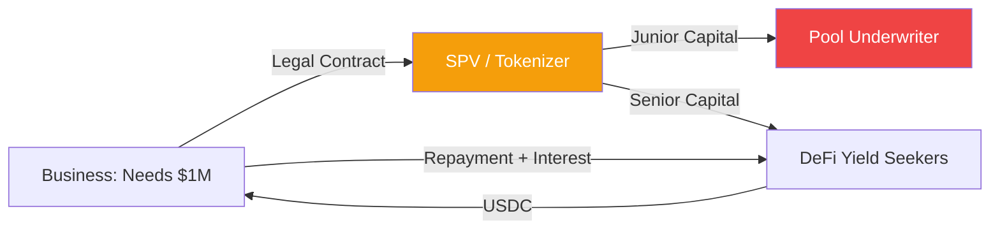

# On-chain Credit Markets: Bridging TradFi and DeFi

On-chain credit markets represent a fundamental shift in how businesses access capital. Traditionally, credit is managed by banks through opaque manual processes. DeFi credit protocols (like **Centrifuge**, **Maple**, and **Goldfinch**) automate the lending process using smart contracts, allowing real-world borrowers to access global liquidity directly from stablecoin holders.

## 1. Undercollateralized vs. Asset-Backed Lending

In standard DeFi (like Aave), loans are **Overcollateralized**: you must deposit $150 of ETH to borrow $100 of USDC. This is useless for most real-world businesses who need to borrow *against* their future income.

On-chain credit markets solve this in two ways:
- **Asset-Backed (RWA)**: Borrowers tokenize real-world collateral (invoices, real estate, carbon credits) and use the tokens as collateral.
- **Undercollateralized (Institutional)**: Known entities (market makers, hedge funds) borrow based on their credit reputation and off-chain legal contracts.

## 2. The Tranche Structure (Waterfall Model)

To protect investors, many credit protocols use a **Tranche** system, similar to traditional Securitization:
1.  **Senior Tranche (Junior First Loss)**: Investors in the Senior tranche get a lower, fixed yield but are protected from the first $X\%$ of defaults.
2.  **Junior Tranche (Equity)**: These investors take the first hit if a borrower defaults but earn a much higher yield. They act as a "buffer" for the Senior investors.

## 3. The Role of Underwriters (Delegates)

Since the blockchain cannot physically visit a factory to audit its books, these protocols rely on **Pool Delegates**:
- They are professional credit analysts who vet borrowers off-chain.
- They "stake" their own capital into the Junior tranche, putting their "skin in the game."
- If they do a poor job, their capital is slashed first.

## 4. Why it Matters for High-Finance

- **Efficiency**: Eliminating the overhead of a commercial bank's middle office can reduce borrowing costs by 100-200 basis points.
- **Transparency**: Every payment and default is visible on-chain in real-time, preventing the "hidden rot" that led to the 2008 subprime crisis.
- **Composability**: A credit token representing a loan to a solar farm in Africa can be used as collateral in other [[cedefi-mechanics|CeDeFi]] protocols, creating a global, interconnected yield machine.

## Visualization: The Credit Pipeline

## Related Topics

[[asset-tokenization]] — how the collateral is brought on-chain  
[[cedefi-mechanics]] — the legal environment for these loans  
[[risk-management]] — evaluating default probabilities in DeFi
---
