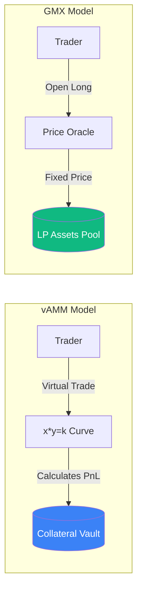

# On-chain Perpetuals and vAMM Mechanics

**Perpetual Swaps (Perps)** are the most traded instruments in the crypto-economy. Unlike standard futures, they have no expiry date and use a **Funding Rate** to keep the price aligned with the spot market. Bringing Perps on-chain allows for leveraged trading without centralized intermediaries.

## 1. Funding Rates: The Peg Mechanism

The Funding Rate is the heartbeat of a perpetual contract. It is a periodic payment between long and short traders:
- **If Perp Price > Spot Price**: Longs pay Shorts (Funding is positive). This encourages traders to sell, pushing the price down.
- **If Perp Price < Spot Price**: Shorts pay Longs (Funding is negative). This encourages buying, pushing the price up.

$$ \text{Funding Rate} = (\text{Premium Index} + \text{Interest Rate}) / 8 $$

## 2. vAMM (Virtual Automated Market Maker)

Pioneered by **Perpetual Protocol**, vAMMs allow leveraged trading without a physical liquidity pool.
- There are no real tokens inside the vAMM.
- It uses the Constant Product formula ($x \times y = k$) to track the **price movement**.
- Collateral is stored in a separate "Vault." The vAMM merely calculates the profit or loss (PnL) of the position based on the virtual curve.

## 3. LP-as-Counterparty Model (GMX Model)

This model (used by **GMX** and **Jupiter**) is popular for institutional CeDeFi:
- Liquidity Providers (LPs) deposit a basket of assets (e.g., BTC, ETH, USDC) into a pool called **GLP**.
- When a trader goes Long, they are "renting" the upside from the GLP pool.
- When a trader loses, their losses go directly to the LPs.
- The price is determined by high-performance [[oracle-design|Oracles]] (Pyth, Chainlink), eliminating slippage for small to medium trades.

## 4. Order-book Based DEXs (dYdX Model)

To approach the performance of a Centralized Exchange (CEX), some protocols move the order book to a specialized Layer 2 or Layer 3 (App-chain).
- **Matching Engine**: Happens off-chain or on a specialized sub-second chain.
- **Settlement**: The final movement of funds happens on-chain.
- This is the preferred model for **Market Makers** who need low latency and low transaction costs.

## 5. Risk for Your Project

1.  **Liquidation Cascades**: If the protocol's liquidation engine is slow, a fast price drop can leave the system with **Bad Debt** (where user losses exceed their collateral).
2.  **Oracle Lag**: If an oracle is slower than a CEX, traders can exploit "Latency Arbitrage," stealing value from the LPs.

## Visualization: vAMM vs. Oracle Model

## Related Topics

[[oracle-design]] — the critical component for Perp DEXs  
[[stablecoin-mechanisms]] — using delta-neutral perps to create stability  
risk-management — modeling the risk of bad debt in leveraged pools
---
