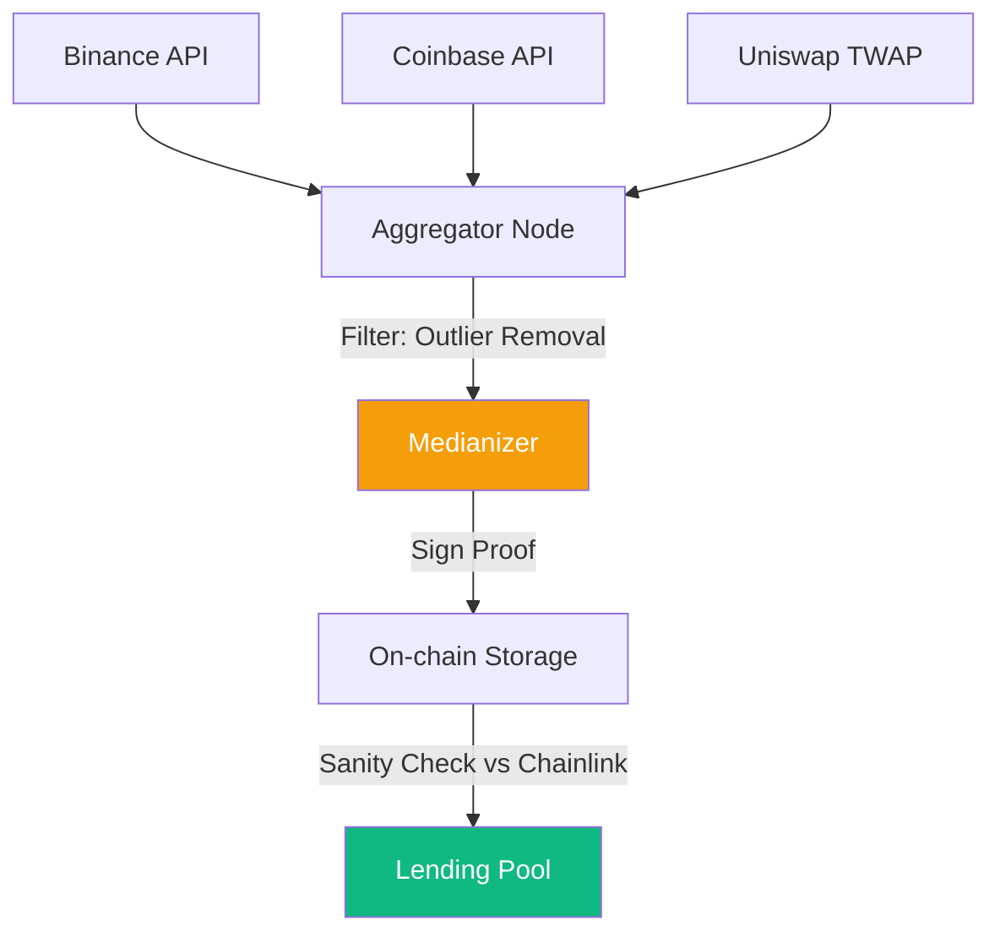

# Oracle Design and Resilience: Engineering Financial Truth

An **Oracle** is the bridge between the deterministic world of a smart contract and the probabilistic world of external data. For a **CeDeFi** project, the oracle represents the single most significant technical risk. A stale or manipulated price can trigger false liquidations of institutional collateral, leading to catastrophic financial loss and legal liability.

## 1. Triggering Mechanisms: Heartbeat and Deviation

How often should an oracle update? 
1.  **Deviation Threshold**: The oracle pushes a new price if the market value moves by more than $X\%$ (e.g., 0.5%) since the last update.
2.  **Heartbeat**: A safety mechanism that forces an update if $T$ minutes have passed (e.g., 20 minutes) even if the price hasn't moved.
- **Project Risk**: In high-volatility environments (a "flash crash"), the deviation threshold might not be reached fast enough on a congested network, making the on-chain price stale.

## 2. Robust Price Discovery: The Medianizer

To prevent a single exchange (like a low-liquidity DEX) from ruining the price feed, professional oracles use a **Medianizer**:
- Collect prices from $N$ independent sources (Binance, Coinbase, Kraken, Uniswap V3, Chainlink).
- Sort the prices and pick the **Median**.
- **Math**: The median is robust against $N/2$ faulty nodes. Even if two exchanges are hacked and report a price of $\$0$, the median will remain stable as long as the majority are correct.

## 3. Oracle Extractable Value (OEV)

**OEV** is a subset of [[mev|MEV]] where the oracle update itself is used to trigger a profitable event.
- **Scenario**: An oracle update pushes the price of ETH down, making 100 loans eligible for liquidation.
- **Front-running the Truth**: MEV bots will sandwich the oracle update transaction, buying the collateral at a discount before the market even knows the price has changed.
- **Mitigation**: Use **OEV-Share** (e.g., API3) or **Flashbots** to capture this value and return it to the protocol's treasury or its users.

## 4. Resilience Patterns for CeDeFi

For an institutional project, implement **Multi-Oracle Consensus**:
- **Primary Source**: High-frequency Pull Oracle (Pyth) for sub-second trading.
- **Secondary Source**: Push Oracle (Chainlink) as a "sanity check."
- **Logic**: If `abs(Pyth_Price - Chainlink_Price) / Chainlink_Price > 0.02`, the smart contract enters a **Safe Mode** where liquidations are paused until human intervention or until prices converge.

## 5. Defense against Flash Loan Attacks

Attackers often manipulate the **Spot Price** on a DEX. 
- **The Fix**: Use **TWAP (Time-Weighted Average Price)** over a 30-60 minute window. 
- **Cost Analysis**: To manipulate a 30-minute TWAP, an attacker must hold the price at an artificial level for 30 minutes, which is exponentially more expensive than a single-block manipulation, usually resulting in a net loss for the attacker.

## Visualization: The Multi-Layer Oracle

## Related Topics

[[cedefi-gateway-architecture]] — handling the API data feeds  
[[lending-mechanics]] — how prices trigger liquidations  
[[mev]] — the predator of oracle updates
---
