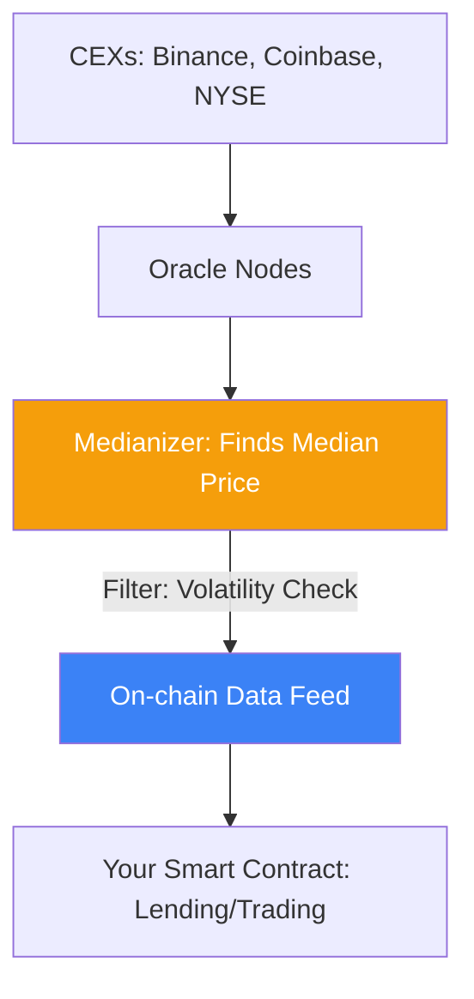

# Oracle Design and Resilience: The Data Lifeblood

An **Oracle** is a service that provides off-chain data (like the price of TSLA or BTC/USD) to on-chain smart contracts. For a **CeDeFi** project, the oracle is the most dangerous point of failure. If an oracle reports a wrong price, your lending pool can be drained in seconds.

## 1. Push vs. Pull Models

### A. Push Oracles (Chainlink Style)
The oracle nodes periodically "push" data to the blockchain.
- **Pros**: Data is always available on-chain for any contract to read.
- **Cons**: High gas costs (nodes pay for every update). Updates are infrequent (e.g., every 0.5% price move).

### B. Pull Oracles (Pyth Style)
Data exists off-chain in a verified state. Users "pull" the data onto the blockchain only when they need to execute a transaction.
- **Pros**: Low latency (sub-second updates), zero gas costs for the provider.
- **Cons**: Requires users to provide the price proof in the same transaction.

## 2. Oracle Manipulation Attacks

The most common hack in DeFi. An attacker uses a **Flash Loan** to artificially inflate the price of an asset on a low-liquidity [[amm-mechanics|DEX]].
1.  **Manipulate**: Buy a lot of Token A on Uniswap (Price A goes up).
2.  **Exploit**: Use Token A as collateral in a lending pool. Because the pool uses the Uniswap spot price as an oracle, it thinks the attacker is now rich.
3.  **Drain**: Borrow huge amounts of USDC against the fake collateral value and vanish.

## 3. Defense Mechanisms for Your Project

### A. TWAP (Time-Weighted Average Price)
Instead of using the latest spot price, use the average price over the last 30-60 minutes. This makes manipulation extremely expensive, as the attacker would need to hold the skewed price for a long duration.

### B. Multi-Source Aggregation
Never rely on a single exchange. Combine data from:
- Decentralized Oracles (Chainlink, Pyth).
- Centralized Exchange APIs (Binance, Coinbase).
- Internal Whitelisted feeds (CeDeFi specific).

### C. Deviation Thresholds and Circuit Breakers
- **Sanity Check**: If an oracle reports a price that is 10% different from the previous update in 1 second, pause the system.
- **Comparison**: If two oracles (e.g., Chainlink and Pyth) disagree by more than 2%, stop all liquidations and trades.

## 4. The "Liveness" vs. "Safety" Trade-off

- **Liveness**: The system must keep working even if data is slightly stale.
- **Safety**: The system should shut down rather than use incorrect data.
For institutional CeDeFi, **Safety** is always prioritized. It is better to pause the protocol than to allow a single incorrect liquidation.

## Visualization: Oracle Data Flow

## Related Topics

[[amm-mechanics]] — the source of manipulation risk  
[[cedefi-gateway-architecture]] — managing the whitelisted feeds  
[[risk-management]] — quantifying oracle failure probabilities
---
