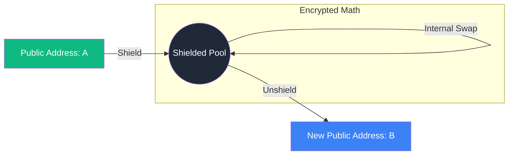

# Privacy-Preserving DeFi: The Shielded Economy

A major barrier to institutional adoption is the **Public Ledger Paradox**: while transparency is great for auditing, it is toxic for competitive strategy. Institutions don't want the market to front-run their trades or copy their proprietary alpha. **Privacy DeFi** (using protocols like **Railgun** or **Panther**) solves this by creating **Shielded Pools**.

## 1. How Shielded Pools Work

A Shielded Pool uses **ZK-SNARKs** (Zero-Knowledge Succinct Non-Interactive Arguments of Knowledge) to decouple the history of a transaction from its current owner.

1.  **Shielding**: A user deposits "public" tokens (USDC, ETH) into a smart contract. They receive a private "note" or commitment.
2.  **Private Interactions**: Inside the pool, the user can swap tokens or lend assets. The transaction is proven correct via ZK-math, but observers see only encrypted data.
3.  **Unshielding**: The user withdraws tokens to a fresh public address. To the outside world, the link between the entry and exit addresses is broken.

## 2. Institutional Privacy vs. Anonymity

There is a critical difference between **Anonymity** (used by bad actors) and **Confidentiality** (required by institutions).
- **View Keys**: Privacy DeFi for CeDeFi allows users to generate "View Keys." These keys can be given to auditors or regulators to see the transaction history without making it public to everyone.
- **Compliance Integration**: By combining [[zk-kyc|ZK-KYC]] with Shielded Pools, a project can ensure that only "clean" identities can enter the private pool, while keeping their activities hidden from competitors.

## 3. Dark Pools (The Institutional Dream)

In traditional finance, a **Dark Pool** is a private forum for trading large blocks of securities without revealing the price or volume until after the trade.
- **On-chain Dark Pools**: Use Multi-Party Computation (MPC) and ZK-proofs to match buy and sell orders.
- **Zero Information Leakage**: Neither the market nor the pool operator knows the contents of the orders until a match is found. This completely eliminates [[mev|Front-running]].

## 4. Risks and Regulatory Pressure

1.  **Regulatory Scrutiny**: Protocols that offer 100% anonymity (like Tornado Cash) are under heavy legal pressure.
2.  **Solvency Risk**: If there is a bug in the ZK-circuit of a shielded pool, tokens could be "double spent" or stolen, and because it's private, it might take weeks for anyone to notice.

## 5. Value for Your Project

By offering a "Shielded" feature:
- You protect your users from **Copy-trading bots**.
- You prevent **MEV bots** from sandwiching their trades.
- You provide the **Institutional Confidentiality** required by large-scale capital providers.

## Visualization: The Shielding Process

## Related Topics

[[zk-kyc]] — proving identity for the shielded pool  
[[mev]] — the problem that privacy solves  
[[cedefi-gateway-architecture]] — how to manage view keys for compliance
---
