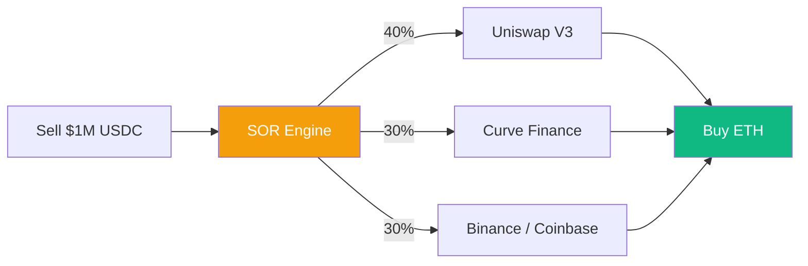

# Smart Order Routing (SOR): Optimizing Liquidity

In a fragmented financial landscape, liquidity is spread across hundreds of venues: decentralized exchanges ([[amm-mechanics|AMMs]]), order books, and centralized exchanges. **Smart Order Routing (SOR)** is the algorithmic process of finding the most efficient path to execute a trade, minimizing price impact and transaction costs.

## 1. The Fragmentation Problem

Executing a large trade (e.g., $10M) in a single pool often results in massive **Slippage**. 
- **AMM Slippage**: $ \Delta P \propto \frac{\text{Trade Size}}{\text{Pool Liquidity}} $
- **The Solution**: Instead of using one pool, SOR splits the order across multiple routes and protocols simultaneously.

## 2. Algorithms and Pathfinding

SOR treats the DeFi ecosystem as a **Directed Acyclic Graph (DAG)**:
- **Nodes**: Tokens (ETH, USDC, DAI).
- **Edges**: Liquidity pools or pairs.
- **Weights**: The cost of exchange (price + fee + gas).

### A. Multi-hop Routing
Exchanging Token A for Token C via Token B (A -> B -> C) because the direct A -> C pool is illiquid.
### B. Split Routing
Executing 40% of the trade on Uniswap V3, 30% on Curve, and 30% on a Centralized Exchange.

## 3. The Objective Function

A sophisticated SOR optimizer (like the one used by **1inch** or **CoW Swap**) solves a non-linear optimization problem:
$$ \max (\text{Output Tokens} - \text{Gas Costs} - \text{MEV Risk}) $$

- **Gas Awareness**: In DeFi, a route with 5 hops might offer a better price but the higher gas fee makes it less efficient than a 2-hop route.
- **MEV Protection**: SOR must account for the risk of [[mev|sandwich attacks]]. Using "Coincidence of Wants" (CoW) or private relayers is a common defense.

## 4. SOR in CeDeFi

For a CeDeFi project, SOR is the bridge between two worlds:
1.  **Hybrid Routing**: Routing an order to a Centralized Exchange (Binance) if the on-chain liquidity is insufficient.
2.  **Inventory Management**: Using the gateway's own liquidity to fill part of the order (Internalization) before sending the rest to the open market.

## Visualization: Split Routing Example

## Related Topics

[[amm-mechanics]] — the venues being routed  
[[mev]] — the predator of inefficient routing  
[[cedefi-gateway-architecture]] — where the SOR logic typically resides
---
