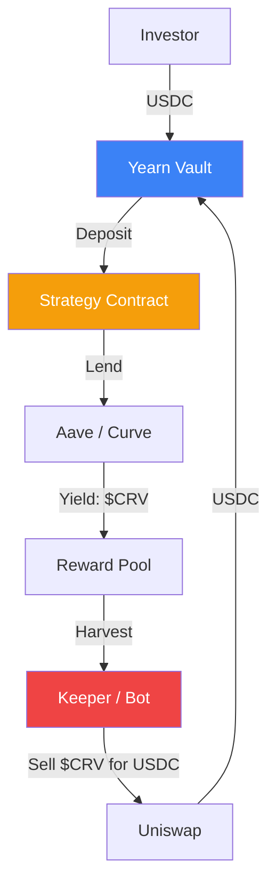

# Yield Aggregators and Strategy Automation

**Yield Aggregators** (e.g., **Yearn Finance**, **Beefy**) are protocols that automate the process of "yield farming." Instead of a user manually moving funds between different lending pools to find the best interest rate, an aggregator uses smart contracts (often called **Vaults**) to execute complex, multi-step investment strategies.

## 1. The Vault Architecture

A Yield Aggregator consists of three main components:
1.  **The Vault**: The entry point where users deposit funds (e.g., USDC). The Vault issues "shares" (yUSDC) representing the user's portion of the total pool.
2.  **The Controller**: The governance logic that decides which **Strategy** is currently the most profitable.
3.  **The Strategy**: A specialized smart contract that interacts with external protocols ([[lending-mechanics|Aave]], Curve, Convex) to generate yield.

## 2. Auto-Compounding Mechanics

The core value of an aggregator is **Auto-Compounding**. 
- In many DeFi protocols, rewards are paid in volatile tokens (e.g., $CRV$ or $AAVE$). 
- An aggregator's strategy automatically "harvests" these rewards, sells them for the underlying asset (USDC), and re-deposits them into the pool.
- This creates a **Compounded APY** that is mathematically higher than the simple APR offered by the underlying protocol.

## 3. Risk Assessment: The Strategy Stack

For a CeDeFi project, aggregators introduce "Stacked Risk":
- **Protocol Risk**: The risk of a bug in Aave.
- **Aggregator Risk**: The risk of a bug in the Yearn Vault.
- **Liquidity Risk**: The risk that the aggregator cannot withdraw funds if the underlying pool's [[lending-mechanics|Utilization Rate]] is 100%.

## 4. Institutional Customization

Aggregators for CeDeFi often implement **Curated Strategies**:
- **Delta-Neutral Staking**: Combining staking rewards with a short position to eliminate price exposure.
- **Low-Volatility Farming**: Restricting the strategy to only blue-chip stablecoins and audited protocols.
- **Governance Boosting**: Using the platform's large holdings to participate in "Curve Wars," increasing the yield for all users by voting for higher rewards on specific pools.

## Visualization: The Harvest Loop

## Related Topics

[[lending-mechanics]] — the source of yield for most aggregators  
[[smart-order-routing]] — how aggregators sell rewards efficiently  
[[stablecoin-mechanisms]] — the primary assets used in low-risk vaults
---
