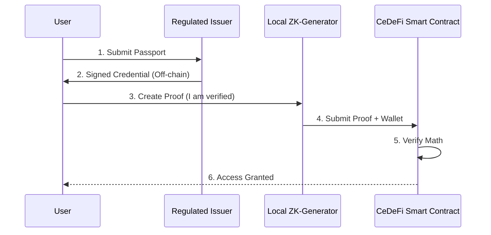

# ZK-KYC: Privacy-Preserving Compliance in CeDeFi

One of the biggest hurdles for **CeDeFi** adoption is the conflict between **Transparency** (Blockchain) and **Privacy** (Personal Data Protection). Regulators require that every user is identified (KYC), but users don't want their passport details stored on a public ledger. **ZK-KYC**, using Zero-Knowledge Proofs, is the technical solution to this dilemma.

## 1. The Core Mechanism: Proof of Identity

Instead of uploading a passport directly to a smart contract, the ZK-KYC process works as follows:
1.  **Verification**: A user goes through a standard KYC process with a trusted, regulated third-party (the **Issuer**).
2.  **Commitment**: The Issuer verifies the user and issues a digital "credential" (a hash) signed by the Issuer's private key.
3.  **ZK-Proof Generation**: The user generates a **Zero-Knowledge Proof** (using zk-SNARKs or STARKs) on their own device. This proof says: *"I possess a valid credential from a trusted Issuer, and I am over 18 years old."*
4.  **On-chain Verification**: The user sends only the **Proof** and their **Wallet Address** to the CeDeFi smart contract. The contract verifies the proof is mathematically correct without ever seeing the user's name or documents.

## 2. Selective Disclosure

ZK-KYC allows for "Minimal Data Disclosure." You can prove specific attributes without revealing others:
- **Proof of Residency**: Prove you are not from a sanctioned country without revealing your exact city or address.
- **Proof of Funds**: Prove you have at least $10,000 without revealing your total net worth.
- **Proof of Accreditation**: Prove you are an "Accredited Investor" required for [[onchain-credit|private credit markets]].

## 3. The Technical Stack: Soulbound Tokens (SBTs)

Many CeDeFi projects implement ZK-KYC using **Soulbound Tokens**.
- An SBT is a non-transferable NFT that represents a user's verified status.
- The smart contract checks for the presence of a valid ZK-SBT before allowing any interaction with the liquidity pool.
- If the user's status changes (e.g., their ID expires), the Issuer can "revoke" the SBT or mark it as invalid on-chain.

## 4. Strategic Value for Your Project

If you implement ZK-KYC in your CeDeFi project:
1.  **Legal Compliance**: You satisfy the requirements of AML/KYC regulators (OFAC, FinCEN).
2.  **User Trust**: You win the trust of privacy-conscious users by guaranteeing that their data is never leaked, even if your smart contract is audited by third parties.
3.  **Institutional Access**: Large funds are more likely to use your platform because it minimizes their "Data Liability"—they don't have to worry about storing and protecting user data themselves.

## Visualization: The ZK-KYC Flow

## Related Topics

[[cedefi-gateway-architecture]] — where the ZK-verifier lives  
[[asset-tokenization]] — requiring ZK-KYC for high-value assets  
[[onchain-credit]] — using ZK-KYC to verify borrowers
---
