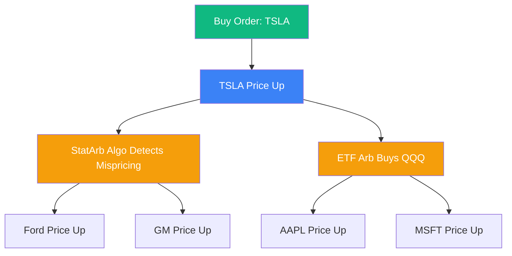

# Cross-Impact Models in Microstructure

In classic market microstructure (like the [[kyle-model|Kyle Model]] or [[market-impact|Square-root law]]), a trade in asset $i$ only impacts the price of asset $i$. In modern markets dominated by ETFs, index arbitrageurs, and statistical arbitrage algorithms, trading asset $i$ simultaneously moves the prices of assets $j, k, \dots, N$. This is **Cross-Impact**.

## The Mechanism of Cross-Impact

Imagine a large fund buys \$100 million of Tesla (TSLA) stock.
1.  **Direct Impact**: The limit order book of TSLA is depleted, and the price rises.
2.  **ETF Arbitrage**: The price of TSLA is now "too high" relative to the NASDAQ-100 ETF (QQQ). High-Frequency Traders (HFT) instantly buy QQQ and short TSLA to capture the spread.
3.  **Cross-Impact**: By buying QQQ, the HFTs force the ETF market makers to buy the underlying components (Apple, Microsoft, Nvidia). Thus, buying TSLA mechanically pushes up the price of Apple.

## Mathematical Formulation

In a multi-asset universe, the price change vector $\Delta P \in \mathbb{R}^N$ is related to the order flow vector $q \in \mathbb{R}^N$ via a **Cross-Impact Matrix** $\Lambda$:

$$\Delta P = \Lambda f(q)$$

Where $f(q)$ is some non-linear function (e.g., component-wise square root $sign(q)\sqrt{|q|}$), and $\Lambda$ is an $N \times N$ matrix.

- **Diagonal elements** $\Lambda_{ii}$: Direct impact (own-impact).
- **Off-diagonal elements** $\Lambda_{ij}$: Cross-impact of trading asset $j$ on asset $i$.

## The No-Arbitrage Condition

A fundamental theoretical result (e.g., Schneider & Lillo, 2019) is that the cross-impact matrix $\Lambda$ must be **Positive Semi-Definite (PSD)**.
If $\Lambda$ is not PSD, a cunning trader could construct a "round-trip" trade (buying and selling a basket of correlated assets in a specific sequence) that systematically extracts infinite money from the market makers purely through mechanical impact.

## Eigen-Impact and Risk Models

In practice, large quantitative hedge funds (like Citadel or Two Sigma) do not model the $5000 \times 5000$ matrix directly, as it is too noisy. Instead, they project the impact onto **Principal Components** or Risk Factors:
1.  **Market factor**: Trading any stock moves the whole market up.
2.  **Sector factors**: Trading Exxon moves Chevron.

When a portfolio manager wants to liquidate a massive portfolio, the execution algorithm optimizes the trajectory in the **eigen-space** of the cross-impact matrix (see [[eigenvalues-eigenvectors]]), ensuring that the selling of correlated assets does not mutually cannibalize their prices.

## Visualization: The Cross-Impact Network

*A single localized shock (green) instantly diffuses through the liquidity network via arbitrageurs (orange), mechanically shifting the entire market surface.*

## Related Topics

[[market-impact]] — the 1D base case  
[[optimal-execution]] — multi-asset liquidation  
[[random-matrix-theory]] — cleaning the noise from the empirical $\Lambda$ matrix  
[[eigenvalues-eigenvectors]] — the linear algebraic core of impact analysis
---
