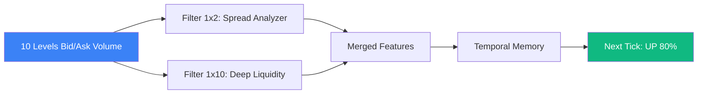

# Deep LOB: Convolutional Networks for the Order Book

In high-frequency trading (HFT), predicting the mid-price movement for the next 10-100 milliseconds requires analyzing the **Limit Order Book (LOB)**. Traditional models (like [[order-flow-imbalance|OFI]]) use handcrafted, linear features. **Deep LOB** (Sirignano, 2018) treats the order book as an image and uses **Convolutional Neural Networks (CNNs)** and LSTMs to extract non-linear microstructural features automatically.

## The Order Book as an Image

The LOB at any timestamp $t$ can be represented as a 2D matrix (an "image" or a snapshot), where:
- The rows represent price levels (Best Bid, Best Ask, 2nd Bid, 2nd Ask, up to Level 10).
- The columns represent features: Price, Volume.
- Time is the third dimension (depth).

A tensor of shape $(100 \text{ time steps} \times 40 \text{ price/volume levels} \times 1)$ is fed into the network.

## The Network Architecture

The Deep LOB architecture typically involves:
1.  **Inception Modules (CNNs)**: Convolutions of different sizes ($1 \times 2$, $1 \times 4$, $1 \times 8$) slide across the price levels.
    - *Why?* A $1 \times 2$ filter learns local features (like the immediate bid-ask spread). A $1 \times 10$ filter learns deep liquidity features (e.g., detecting a massive hidden wall of sellers at Level 5).
2.  **LSTMs**: The spatial features extracted by the CNNs are fed into a recurrent layer to capture the *temporal dynamics* (e.g., is the queue growing or shrinking over the last 100ms?).
3.  **Output**: A Softmax layer predicting the probability of an Up, Down, or Flat move in the next tick.

## Why it Dominates Handcrafted Features

Human quants often look at "Order Book Imbalance" (Volume at Bid vs. Volume at Ask).
Deep LOB discovers far more complex interactions:
- **Liquidity Void Detection**: It can detect if Level 2 and 3 are empty, meaning an incoming market order will cause massive slippage, predicting a sharp price jump.
- **Spoofing Detection**: It learns the temporal signature of fake orders being placed and immediately cancelled.

## Practical Challenges in Deployment

1.  **Latency**: HFT operates in microseconds. Running a 50-layer ResNet takes milliseconds. Deep LOB models must be aggressively pruned, quantized to INT8 (see [[modern-quantization]]), and deployed directly onto **FPGAs** (Field-Programmable Gate Arrays) to be fast enough to trade.
2.  **Stationarity**: Order book patterns change constantly due to new competitor algorithms. Deep LOB models degrade quickly and must be retrained continuously (Online Learning).

## Visualization: The CNN sliding over LOB

## Related Topics

limit-order-book — the data structure  
[[order-flow-imbalance]] — the traditional feature being replaced  
[[queue-reactive-models]] — the stochastic math equivalent of this ML approach
---
