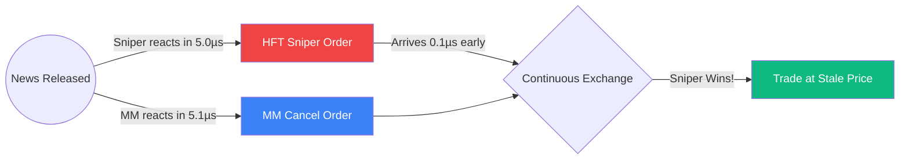

# Latency Arbitrage and Frequent Batch Auctions

The prevailing market design for global electronic exchanges is the **Continuous Limit Order Book (CLOB)**. In a seminal 2015 paper, economists Budish, Cramton, and Shim proved mathematically that the CLOB is fundamentally flawed because it creates a purely mechanical arbitrage opportunity known as **Latency Arbitrage**, which acts as a permanent tax on liquidity.

## The Flaw of Continuous Time

In a continuous market, orders are processed strictly sequentially based on their arrival timestamp.
Imagine a market maker quoting a Bid/Ask spread for Apple stock on the NYSE. Suddenly, an economic report is released in Chicago.
- The "true" value of Apple jumps.
- The market maker's quotes are now "stale" (wrong).
- The market maker sends a message to cancel their stale quotes.
- A High-Frequency Trading (HFT) "Sniper" reads the news and sends a message to buy from the market maker at the stale price.

Because the market is continuous, it becomes a **footrace**. Even if the market maker reacts as fast as physics allows, the sniper will win some percentage of the time if their fiber-optic cable is just a few meters shorter.

## The Liquidity Tax

This mechanical race creates a continuous risk for market makers: **Adverse Selection via Latency**.
Knowing they will inevitably lose to snipers, market makers defend themselves by **widening the bid-ask spread** for everyone. This spread widening is the "Liquidity Tax" that all normal investors pay to fund the HFT arms race (microwaves, lasers, FPGA chips).

## The Solution: Frequent Batch Auctions (FBA)

Budish, Cramton, and Shim proposed replacing the CLOB with **Frequent Batch Auctions**.
Instead of processing orders continuously, the exchange groups all orders that arrive within a tiny time window (e.g., 10 milliseconds) into a "batch."
1.  Orders are accumulated over 10ms.
2.  At the end of the batch, the exchange crosses supply and demand at a **single clearing price** that maximizes traded volume.
3.  Repeat.

### Why FBA fixes the market:
- **Kills the Footrace**: If the news release and the market maker's cancellation both arrive within the same 10ms batch, they are processed together. The stale quote is canceled *before* the sniper can execute against it.
- **Removes the Liquidity Tax**: Since market makers no longer fear latency arbitrage, they can quote much tighter spreads and larger sizes, vastly improving market quality for long-term investors.

## Visualization: The HFT Race

*In a continuous market, a 0.1-microsecond difference decides the winner. In an FBA market, a 10-millisecond batch would process both messages simultaneously, and the MM's cancel would succeed.*

## Related Topics

[[glosten-milgrom]] — adverse selection theory  
limit-order-book — the architecture being criticized  
[[smart-order-routing]] — how brokers navigate this continuous fragmentation
---
