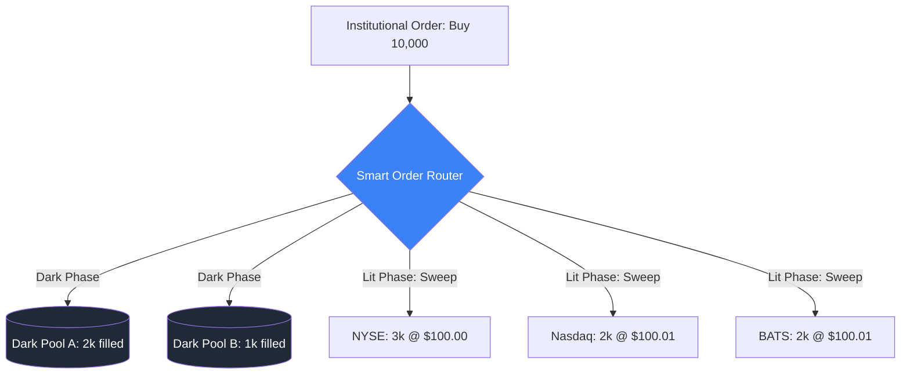

# Smart Order Routing (SOR)

In modern highly fragmented financial markets, a single stock (like Apple or Tesla) is traded simultaneously on dozens of different exchanges (NYSE, Nasdaq, BATS) and "Dark Pools". **Smart Order Routing (SOR)** is the automated process of handling orders to find the best possible execution across all these fragmented liquidity venues.

## The Fragmentation Problem

Before the 2000s, an order to buy IBM went straight to the New York Stock Exchange. Today, due to regulations like Reg NMS (in the US) and MiFID (in Europe), markets are fragmented to encourage competition.
If a broker receives an order to buy 10,000 shares, no single exchange might have enough liquidity at the best price. Sending the whole order to one exchange would cause massive **Market Impact**. 

## How SOR Works

A Smart Order Router operates in milliseconds or microseconds, constantly maintaining a real-time "Consolidated Order Book" of all venues.

1.  **Liquidity Discovery**: The SOR scans both "Lit" exchanges (where the order book is public) and "Dark Pools" (private exchanges where orders are hidden to minimize impact).
2.  **Splitting (Slicing)**: The large order is chopped into smaller "child orders."
3.  **Routing Strategy**: The child orders are sent to different venues simultaneously based on a dynamic algorithm.
    - *Dark First*: Send orders to dark pools first to avoid signaling intention to High-Frequency Traders.
    - *Cost-Optimized*: Route to exchanges that offer "maker-taker" rebates (paying you for providing liquidity).
    - *Speed-Optimized*: Route based on the physical distance to the exchange's data center to minimize latency.

## Avoiding Information Leakage

The biggest risk in SOR is **Information Leakage**. If a SOR sends a child order to Exchange A, High-Frequency Traders (HFTs) on Exchange A might detect it, realize a massive order is coming, and race the SOR to Exchange B to buy the shares there first and sell them back to the SOR at a higher price (a practice known as **Latency Arbitrage** or **Front-Running**).

**Solution**: Modern SORs calculate the exact fiber-optic cable latency to each exchange and delay the sending of orders to closer exchanges so that all child orders arrive at all exchanges at the exact same microsecond.

## Visualization: SOR Splitting

## AI in Modern SOR

Next-generation SORs use Machine Learning (Reinforcement Learning and Deep Neural Networks) to predict the hidden liquidity in dark pools and forecast the short-term price movement before deciding where to route.

## Related Topics

[[market-impact]] — what SOR is trying to minimize  
limit-order-book — the structure the SOR scans  
[[vpin]] — detecting toxic environments where routing is dangerous
---
