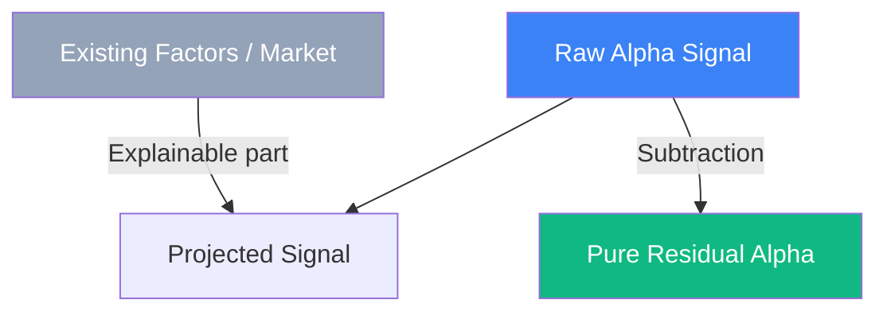

# Alpha Orthogonalization: Factor Independence

In a top-tier hedge fund like Citadel, researchers constantly discover new trading signals (**Alphas**). However, most "new" signals are just hidden versions of existing factors (like Momentum, Value, or Beta). **Alpha Orthogonalization** is the rigorous process of ensuring that a signal provides **Incremental Information** (Marginal Alpha) after accounting for all known risk drivers.

## The Problem: Factor Crowding

If you find a signal that correlates 0.9 with "Tech Momentum," your signal is not new. If you add it to the portfolio alongside Tech Momentum, you are simply doubling down on the same risk, increasing your chance of a blowout without increasing your edge.

## The Mathematical Process

To orthogonalize a new Alpha signal $\alpha_{new}$ against a set of existing factors $F = [f_1, f_2, \dots, f_k]$, we use a variation of the **Gram-Schmidt process** or linear regression.

### 1. Residualization
We run a cross-sectional regression:
$$\alpha_{new} = \beta_1 f_1 + \beta_2 f_2 + \dots + \beta_k f_k + \epsilon$$
The **Residual** $\epsilon$ is the part of the signal that cannot be explained by existing factors. This is the "Pure Alpha."

### 2. Risk Neutralization
Top funds often require signals to be **Neutral** to specific constraints:
- **Market Neutral**: Correlation with S&P 500 is zero.
- **Sector Neutral**: No exposure to Industry groupings.
- **Currency Neutral**: No exposure to FX swings.

## Why Orthogonalization is Critical

1.  **True Capacity**: You can only scale a portfolio if the underlying signals are independent. Correlated signals hit capacity limits very quickly.
2.  **Performance Attribution**: It allows the fund to pay portfolio managers only for the unique value they bring, not for "riding the market tide."
3.  **Alpha Decay Analysis**: By looking at the orthogonalized residual, you can see the true **decay rate** (half-life) of a signal. Often, a signal looks great because it has a market-beta component, but the "pure" part of it decays in minutes.

## Visualization: Vector Orthogonalization

*In the geometry of factors, we only care about the green vector (the part of the signal perpendicular to the market). The blue part is just redundant noise that the fund already knows.*

## Related Topics

[[alpha-factor-discovery]] — how signals are found  
[[factor-attribution]] — identifying which factors drove returns  
[[pca]] — using eigenvectors to find an orthogonal basis of factors
---
