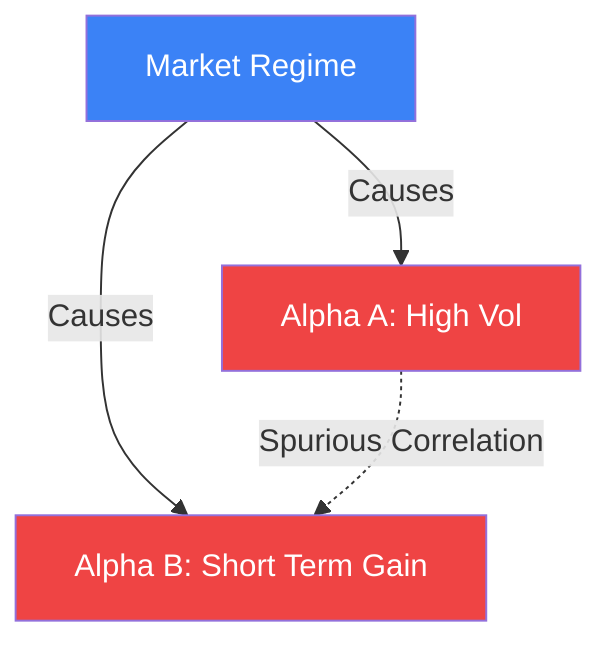

# Causal Inference in Trading

Standard machine learning identifies **correlation**: if the sun rises, the rooster crows. In trading, correlation is dangerous because it is often spurious or driven by a third "confounder" (e.g., market beta). **Causal Inference** attempts to discover the actual physical mechanism—identifying whether $X$ actually causes $Y$.

## Confounders and Spurious Alphas

Imagine an Alpha signal based on social media sentiment ($S$) and stock returns ($R$).
Both might be driven by a third factor: a positive earnings report ($E$).
- $E \to S$ (News makes people tweet).
- $E \to R$ (News makes stock go up).
- A naive model sees $S \to R$ and thinks sentiment *causes* returns.

If the earnings report is delayed, but tweets stay the same, the signal will fail. A **Structural Causal Model (SCM)** helps identify these "backdoor paths."

## Tools of the Trade

### 1. Directed Acyclic Graphs (DAGs)
We map the relationships between variables as a graph. If we see a path $S \leftarrow E \to R$, we know we must **Control** for $E$ (fix it) to see the pure effect of $S$ on $R$.

### 2. The Do-Calculus (Judea Pearl)
The "Do-operator" $P(Y \mid do(X))$ asks: "What happens to $Y$ if I *force* $X$ to change, regardless of its natural causes?"
In finance, we can't run experiments on the real market, so we use **Natural Experiments** (e.g., changes in tick size or exchange rules) to observe $do(X)$.

### 3. Granger Causality vs. True Causality
- **Granger Causality**: "Past values of $X$ help predict $Y$." (Temporal correlation).
- **Causal Inference**: "There is a physical law/mechanism linking $X$ to $Y$."

## Why Citadel uses Causal AI

1.  **Backtest Overfitting**: Standard ML models find patterns that existed by pure luck in the past. Causal models find patterns that are likely to persist because they are tied to market mechanics.
2.  **Policy Evaluation**: "What will happen to my profit if I double my commission?" This is a $do(X)$ question that historical correlation cannot answer.
3.  **Alpha Orthogonalization**: Causal models provide a more robust way to [[alpha-orthogonalization|Orthogonalize]] signals by identifying the hierarchy of factors.

## Visualization: The Confounder Trap

*Correlation (dotted line) suggests A causes B. Causality (solid lines) reveals they are both just puppets of the Market Regime. A causal model will tell you to ignore A if you already know the Market Regime.*

## Related Topics

[[alpha-orthogonalization]] — clearing out explainable parts  
[[causal-inference]] — the general mathematical theory  
[[probability-of-backtest-overfitting]] — the risk Causal AI mitigates
---
