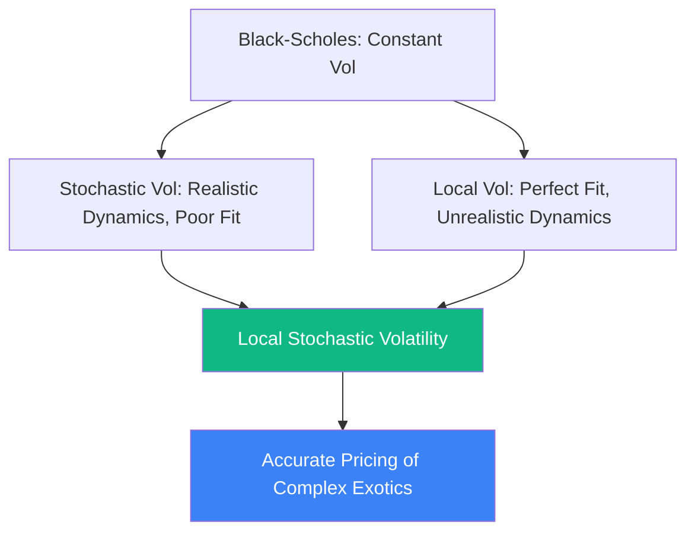

# Local Stochastic Volatility (LSV)

In derivative pricing, **Local Stochastic Volatility (LSV)** models represent the "Holy Grail" of volatility modeling. They combine the perfect market fit of Dupire's **Local Volatility (LV)** with the realistic forward dynamics of **Stochastic Volatility (SV)** models like Heston.

## The Flaws of Predecessors

1.  **Stochastic Volatility (SV) e.g., Heston**: Models the volatility as an independent random process. It creates realistic "smiles" and captures the clustering of volatility. *Flaw*: It cannot perfectly calibrate to the entire observable surface of market options.
2.  **Local Volatility (LV) e.g., Dupire**: Defines volatility as a deterministic function of time and current stock price $\sigma(t, S)$. *Flaw*: It perfectly fits all today's option prices, but implies that the "smile" will flatten out in the future. It misprices forward-starting options and path-dependent exotics.

## The LSV Synthesis

LSV blends both approaches. The asset price $S_t$ and its variance $v_t$ evolve as:
$$dS_t = \mu S_t dt + \sqrt{v_t} \cdot L(t, S_t) \cdot S_t dW_t^1$$
$$dv_t = \kappa(\theta - v_t) dt + \xi \sqrt{v_t} dW_t^2$$

Here, $v_t$ is the stochastic variance, and $L(t, S_t)$ is the **Local Leverage Function**.
- The stochastic part ensures realistic dynamics and correct pricing for forward options.
- The leverage function $L(t, S_t)$ is a deterministic multiplier that "tweaks" the model to perfectly match today's vanilla option prices.

## The Calibration Nightmare (Particle Methods)

Finding the exact shape of the leverage function $L(t, S_t)$ is mathematically brutal. By Gyöngy's Theorem, the LSV model will match the market Local Volatility $\sigma_{Dupire}^2(t, S)$ if:
$$L^2(t, S) = \frac{\sigma_{Dupire}^2(t, S)}{\mathbb{E}[v_t \mid S_t = S]}$$

To calculate the conditional expectation $\mathbb{E}[v_t \mid S_t = S]$, banks cannot use standard analytical formulas. They must solve non-linear Fokker-Planck PDEs or use advanced **Particle Methods (Monte Carlo with interacting particles)**.
In particle methods, thousands of simulated price paths interact with each other at every time step to empirically estimate the conditional variance and update the leverage function on the fly.

## Why Tier-1 Banks Require LSV

If an investment bank trades complex structured products (like Autocallables, Barrier options, or Target Redemption Forwards), pricing them with simple Heston or pure Dupire LV will lead to massive arbitrage losses against hedge funds. LSV is the minimum standard required to guarantee that the model is consistent with both vanilla market data and the reality of forward volatility.

## Visualization: The Volatility Hierarchy

## Related Topics

[[dupire-local-vol]] — the Local Volatility component  
[[heston-model]] — the typical Stochastic Volatility component  
[[hmm-particle-filters]] — the Monte Carlo technique used for LSV calibration
---
