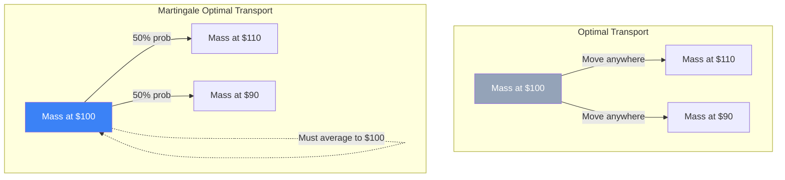

# Martingale Optimal Transport (MOT)

In quantitative finance, pricing exotic derivatives usually requires assuming a specific stochastic model for the underlying asset (e.g., Black-Scholes, Heston, or Local Volatility). If the model is wrong, the price is wrong (Model Risk). **Martingale Optimal Transport (MOT)** is a revolutionary approach that allows quants to calculate the absolute upper and lower bounds for the price of an exotic option **model-free**, using only the observable prices of vanilla options.

## The Setup: Model-Free Pricing

Suppose we want to price an exotic path-dependent option (like a Lookback or Asian option). 
We do not know the true dynamics of the stock $S_t$. However, we observe the market prices of standard European Call and Put options for maturities $T_1$ and $T_2$.
By Breeden-Litzenberger, these prices give us the exact marginal probability distributions of the stock at $T_1$ (let's call it $\mu$) and $T_2$ (let's call it $\nu$).

The question is: What is the highest (and lowest) possible price for the exotic option, given that the stock must exactly follow distribution $\mu$ at $T_1$ and $\nu$ at $T_2$?

## Connection to Optimal Transport

Standard Optimal Transport (the Monge-Kantorovich problem) finds the cheapest way to move a pile of sand (distribution $\mu$) to a hole (distribution $\nu$).
In finance, the "sand" is the probability mass of the stock price. But there is a massive restriction: the market must be arbitrage-free. This implies the price process must be a **Martingale**: the expected future price, given today's price, must be today's price ($\mathbb{E}[S_{T_2} \mid S_{T_1}] = S_{T_1}$).

**Martingale Optimal Transport** restricts the transport plans to only those that preserve the martingale property. 

## The Primal and Dual Problems

- **Primal Problem**: Find the worst-case (or best-case) joint distribution of $(S_{T_1}, S_{T_2})$ that matches the market vanillas $\mu, \nu$ and satisfies the martingale condition, maximizing the expected payoff of the exotic option.
- **Dual Problem (Super-Replication)**: Find a portfolio consisting of a static position in vanilla options (to match the margins) and a dynamic Delta-hedging strategy (using the martingale property) that guarantees a payout greater than or equal to the exotic option in *every possible scenario*.

By Kantorovich Duality, the lowest cost of this super-replicating portfolio is exactly equal to the maximum possible price of the exotic option.

## Why Citadel and Tier-1 Banks Use It

MOT provides a mathematical guarantee. If a bank sells an exotic option at the MOT upper bound, they can construct a robust hedge that is guaranteed not to lose money, regardless of whether volatility jumps, correlates, or does something completely unpredicted by classical models. It is the ultimate defense against Model Risk.

## Visualization: Sand vs. Martingale Sand

## Related Topics

[[risk-neutral-valuation]] — the classic model-dependent paradigm  
[[black-scholes]] — the model we are trying to avoid  
[[convex-optimization-trading]] — how the dual problem is actually solved via linear programming
---
