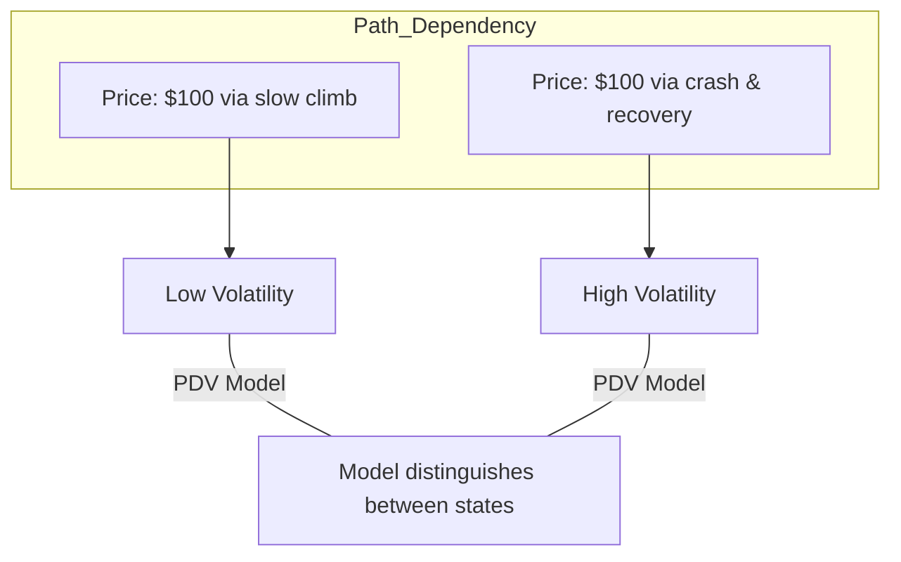

# Path-Dependent Volatility: Beyond Local Volatility

In the classical world of option pricing, Dupire's **Local Volatility (LV)** assumes that volatility is a deterministic function of the current stock price and time: $\sigma(t, S_t)$. While LV can perfectly fit the market "smile" of vanilla options, it fails to capture the dynamics of **path-dependent exotic options** (like Barriers or Lookbacks). **Path-Dependent Volatility (PDV)** models solve this by making volatility a function of the entire history of the asset.

## 1. The Limitation of Dupire's Model

Dupire's model implies a specific relationship between the "spot" price move and the "smile" move. In reality, when the spot price returns to a previous level, the smile often has a different shape because the **realized path** was different. This "memory" is what PDV captures.

## 2. Models of Julien Guyon

**Julien Guyon** (2014) introduced a class of models where volatility is a function of a path-dependent statistic, such as the **Running Maximum** ($M_t = \max_{u \leq t} S_u$) or the **Moving Average**.

The price evolves as:
$$dS_t = \sigma(t, S_t, H_t) S_t dW_t$$
where $H_t$ is the historical statistic. 
- **Advantage**: These models can be calibrated to fit both the vanilla smile AND the market prices of Barrier options simultaneously, which is impossible for standard LV or Heston models.

## 3. Calibration via Particle Methods

Calibrating a PDV model is a massive computational challenge. To find the functional $\sigma$, one must solve the **McKean-Vlasov** stochastic differential equation, where the coefficients depend on the probability distribution of the paths themselves.

The industry-standard solution is the **Interacting Particle System**:
1.  Simulate $N$ (e.g., 100,000) paths of the asset.
2.  At each time step, calculate the conditional expectation $\mathbb{E}[\text{Var} \mid S_t, H_t]$ by averaging over the particles that are "near" the target state.
3.  Update the volatility function and proceed to the next step.

## 4. Connection to Signature-based Models

The most general way to represent "Path Dependency" is through **Path Signatures** (from [[rough-paths|Rough Path Theory]]). By taking the signature of the past returns as an input to a neural network (see [[neural-sdes-finance]]), quants can create a "Universal PDV Model" that learns which parts of the history (e.g., the trend, the twist, or the area) are most relevant for future volatility.

## Visualization: Path-Memory effect

*Standard models see only "$100$". Path-dependent models see the "Story" of how we got to $100$, leading to more accurate risk pricing.*

## Related Topics

[[lsv-model]] — combining path-dependency with stochasticity  
[[hmm-particle-filters]] — the math of interacting particles  
[[signature-based-models]] — representing history via iterated integrals
---
