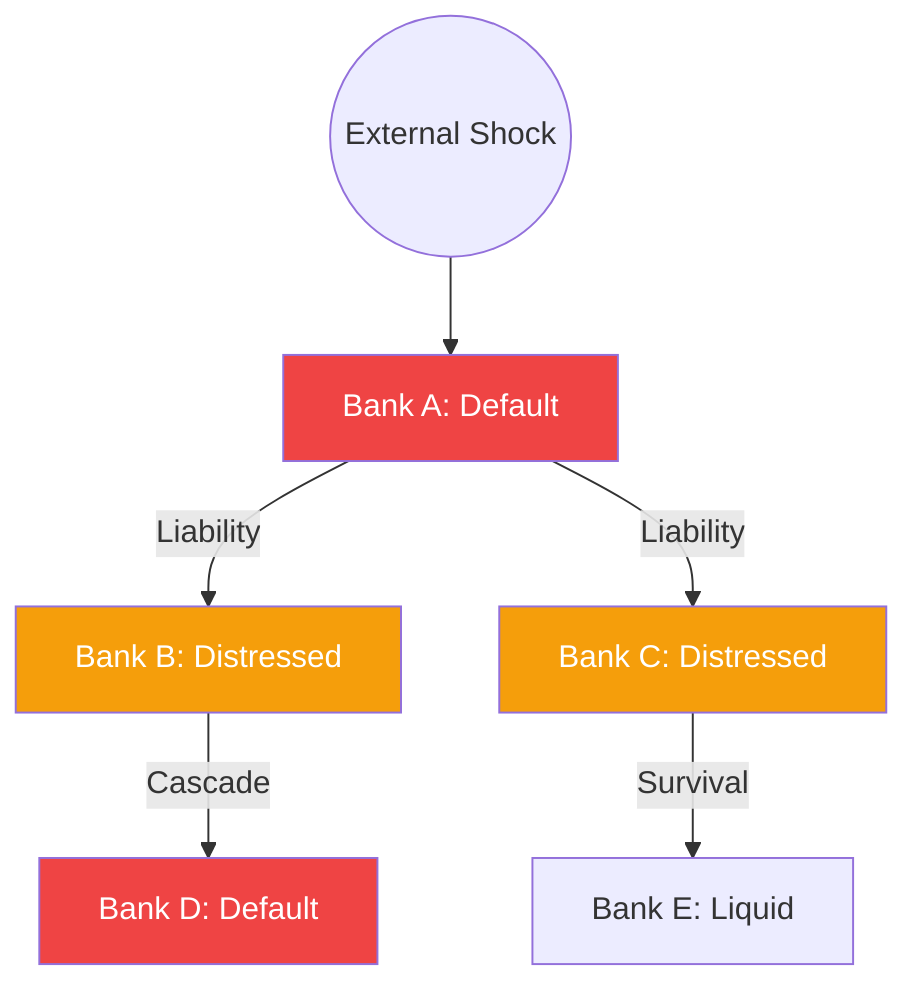

# Network Models and Default Cascades

The 2008 crisis highlighted that financial risk is not just about individual banks, but about the **interconnectedness** of the financial system. Network models of systemic risk study how a shock to one institution can propagate through a web of interbank exposures, leading to a **Default Cascade**.

## The Financial Network as a Graph

A financial system is modeled as a **Directed Graph** $G = (V, E)$:
- **Nodes ($V$)**: Financial institutions (banks, hedge funds).
- **Edges ($E$)**: Interbank liabilities (loans, derivatives, repo).
- **Weights ($L_{ij}$)**: The amount that bank $i$ owes to bank $j$.

## The Eisenberg-Noe Model

The foundational model for clearing liabilities in a network. It calculates a "Clearing Payment" vector $p^*$ such that all banks pay as much as possible given their assets and equity. 
- If a bank's total assets (including what other banks owe it) fall below its liabilities, it is in default.
- Its failure reduces the assets of its creditors, potentially causing them to default as well.

## Default Cascades and the Domino Effect

A cascade occurs when the default of bank $A$ triggers the default of bank $B$, which in turn triggers bank $C$.
- **Contagion Threshold**: There is often a "tipping point" in network density. Below this point, the system is robust. Above this point, a single failure can collapse the entire network.
- **The Paradox of Connectivity**: Diversification is usually good. However, in highly stressed periods, **more connectivity can be dangerous**, as it provides more pathways for the "virus" of default to spread.

## DebtRank: Centrality for Risk

**DebtRank** (Battiston et al., 2012) is an algorithm inspired by Google's PageRank. It measures the "systemic importance" of a bank not by its size, but by how much of the total network's equity would be wiped out if that bank failed.
A small but highly connected bank can have a higher DebtRank than a giant, isolated one.

## Visualization: Network Contagion

## Related Topics

[[systemic-contagion-debtrank]] — early version of this theory  
[[cva-wrong-way-risk]] — the micro-level driver of network risk  
[[repo-market-systemic]] — the specific network where cascades often start
---
