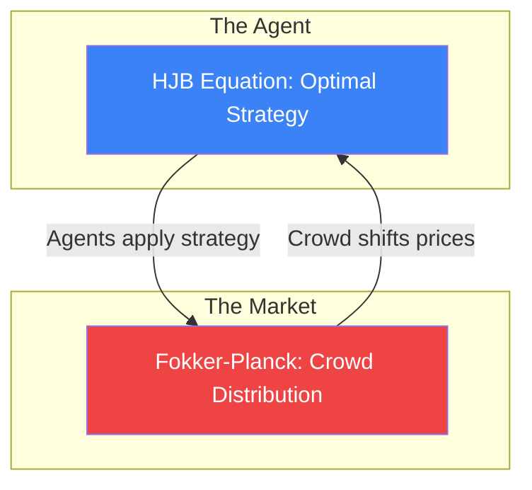

# Mean-Field Games in Finance

In standard microeconomics or game theory, we study interactions between two or three players. But what happens in a modern financial market, where thousands of High-Frequency Trading (HFT) algorithms interact simultaneously in milliseconds? 
Modeling each individual interaction is computationally impossible. **Mean-Field Games (MFG)**, introduced by Lasry and Lions (2006), solve this by treating the crowd of agents as a continuous "fluid," applying the mathematics of statistical physics to financial markets.

## The Core Concept

The fundamental insight of MFG is that in a massive crowd, a single agent doesn't care about what *one specific* other agent is doing. They only care about the **average behavior (the Mean Field)** of the entire crowd.

Each agent (e.g., an HFT algo) plays a game against the "mass distribution" of all other agents. 

## The Coupled Equations

An MFG is mathematically described by a system of two coupled partial differential equations (PDEs) that must reach an equilibrium:

### 1. The HJB Equation (Backward in Time)
The **Hamilton-Jacobi-Bellman** equation determines the optimal strategy for a single agent, *assuming* they know how the crowd will distribute itself. The agent works backward from their goal (e.g., liquidating a portfolio by time $T$) to decide what to do today.

### 2. The Fokker-Planck Equation (Forward in Time)
The **Fokker-Planck (Kolmogorov Forward)** equation describes how the physical distribution of the entire crowd evolves over time, *assuming* everyone follows the optimal strategy found in the HJB equation.

### The Nash Equilibrium
The system is in a **Mean-Field Nash Equilibrium** when the solution to HJB produces strategies that, when plugged into Fokker-Planck, generate the exact crowd distribution that the HJB originally assumed. 

## Applications in Tier-1 Funds

1.  **Optimal Execution in a Crowd**: When you try to sell a large block using [[optimal-execution|Almgren-Chriss]], other algorithms detect your selling and "front-run" you. MFG allows you to calculate an execution trajectory that optimally accounts for the adversarial reaction of the entire market.
2.  **Market Making**: Calculating the optimal bid-ask spread when competing against an infinite continuum of other market makers.
3.  **Systemic Risk**: Modeling "Bank Runs" or "Fire Sales" where the decision of one bank to sell assets depresses the price, forcing the entire distribution of banks to sell, leading to a crash.

## Visualization: The Feedback Loop

*The agent reacts to the crowd, and the crowd is made of agents. The mathematical equilibrium is reached when this feedback loop stabilizes.*

## Related Topics

[[stochastic-control]] — the basis of the HJB equation  
[[nash-equilibrium]] — the discrete version of this concept  
[[optimal-execution]] — the primary applied use-case in HFT
---
