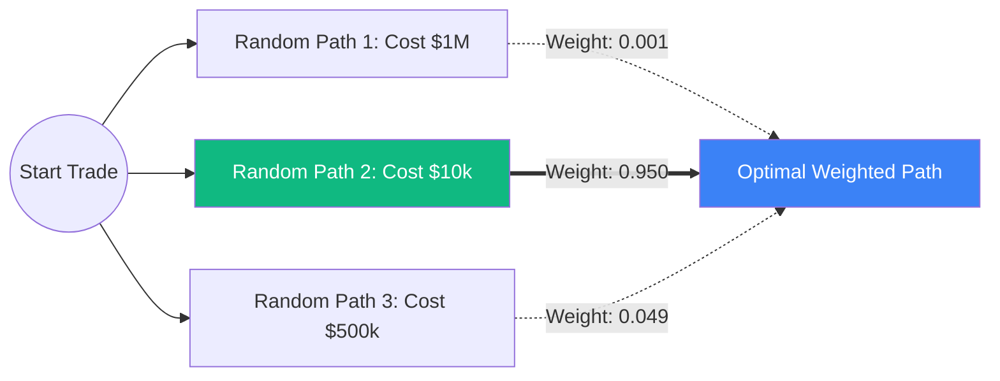

# Path Integral Control in Finance

Standard optimal control in finance (like [[optimal-execution|Almgren-Chriss]] or [[merton-portfolio|Merton's Portfolio]]) requires solving the non-linear Hamilton-Jacobi-Bellman (HJB) equation. In high dimensions, solving the HJB is computationally intractable. 

**Path Integral Control (Path Integral Differential Dynamic Programming - PI-DDP)**, borrowed from quantum physics and robotics, offers a radical solution: it bypasses the HJB PDE entirely and solves the control problem by simulating paths (Monte Carlo) and evaluating their "energy" using the Feynman-Kac formalism.

## The Quantum Physics Connection

In quantum mechanics, a particle doesn't take a single path from A to B; it takes *all possible paths simultaneously*. The probability of going from A to B is found by summing over all paths (Feynman's Path Integral), weighting each path by $e^{-Energy}$.

In finance, if we restrict our control problem such that the cost of control is proportional to the variance of the noise (the "control-affine" setting), the non-linear HJB equation transforms into a **linear Schrödinger-type PDE**. 
Because the PDE is linear, we can use the **Feynman-Kac Theorem** to represent its solution as an expectation over paths.

## The Mathematical Breakthrough

The optimal control $u^*$ (e.g., your trading speed) at any point is given by a simple formula:
$$u^*(x) = \mathbb{E}_{\mathbb{P}} \left[ \text{Sample Control} \cdot \frac{e^{-\text{Cost of Path} / \lambda}}{\mathbb{E}[e^{-\text{Cost of Path} / \lambda}]} \right]$$

This is a **Softmax (or Boltzmann) weighted average**.
You don't need to solve a grid. You simply:
1.  Simulate thousands of random paths (like a drunk trader).
2.  Calculate the final loss (cost) of each path.
3.  The optimal strategy is the average of the random paths, where the "cheap" paths are given exponentially more weight than the "expensive" paths.

## Applications in High-Frequency Trading

1.  **High-Dimensional Execution**: You can optimize the execution of 500 stocks simultaneously. Since it uses Monte Carlo paths, the computational cost scales linearly with the number of stocks, not exponentially.
2.  **Reinforcement Learning**: Path Integral Control is the mathematical foundation for modern RL algorithms like **Soft Actor-Critic (SAC)** and **Maximum Entropy RL**, which are heavily used in automated trading.

## Visualization: The Path Integral

*Instead of solving calculus equations, the algorithm tries thousands of random strategies, scores them, and heavily biases the final strategy toward the paths that accidentally performed the best.*

## Related Topics

[[stochastic-control]] — the classical HJB approach  
[[reinforcement-learning]] — the ML equivalent  
[[quantum-math]] — the physics origin (Schrödinger equation)
---
