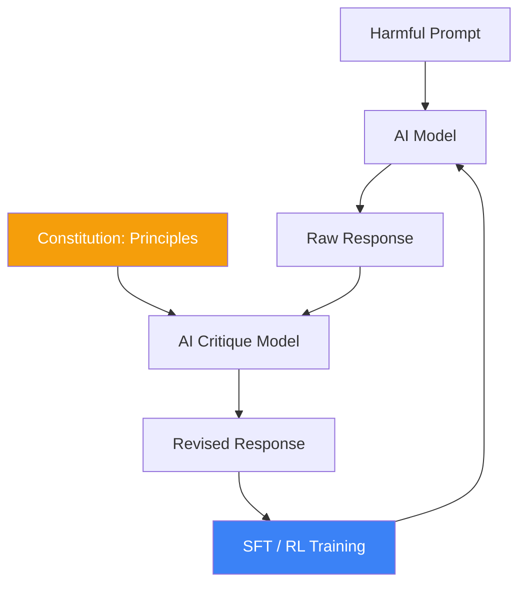

# Constitutional AI and RLAIF: Self-Aligning Systems

**Constitutional AI (CAI)**, pioneered by Anthropic, is a framework for aligning AI models with human values using a set of high-level principles (a "Constitution") instead of direct human feedback for every single output. It replaces **RLHF** (Reinforcement Learning from Human Feedback) with **RLAIF** (Reinforcement Learning from AI Feedback).

## 1. The Core Problem with RLHF

Standard RLHF is:
1.  **Expensive**: Requires thousands of human annotators to rank outputs.
2.  **Subjective**: Human preferences are often inconsistent and biased.
3.  **Black-box**: It is hard to know *why* a model prefers one output over another.

## 2. The CAI Process

CAI operates in two main stages:

### Phase 1: Supervised Learning (Critique and Revision)
1.  **Generation**: The base model generates a response to a potentially harmful prompt.
2.  **Critique**: The model is asked to critique its own response based on a specific principle from the Constitution (e.g., "Choose the response that is most helpful and least harmful").
3.  **Revision**: The model rewrites the response based on the critique.
4.  **Fine-tuning**: The original model is fine-tuned on these revised "clean" responses.

### Phase 2: Reinforcement Learning (RLAIF)
Instead of humans ranking outputs, a **Feedback Model** (the model from Phase 1) ranks them according to the Constitution. A preference dataset is generated automatically, and the final model is trained using a standard RL algorithm (like PPO).

## 3. The Constitution

The Constitution is a list of written rules. Examples include:
- "Please choose the response that is most supportive of human rights."
- "Avoid being pedantic, preachy, or annoying."
- "Do not provide advice that would help someone commit a crime."

## 4. Strategic Benefits

- **Transparency**: Alignment is driven by readable rules, not hidden human biases.
- **Scalability**: AI feedback is millions of times faster and cheaper than human feedback.
- **Safety-Efficiency Frontier**: CAI models often outperform RLHF models in safety benchmarks without sacrificing reasoning capability.

## Visualization: The CAI Feedback Loop

## Related Topics

llm-alignment — general concepts of alignment  
[[reinforcement-learning]] — the underlying training mechanics  
[[mechanistic-interpretability]] — checking if the alignment is real or "faked"
---
