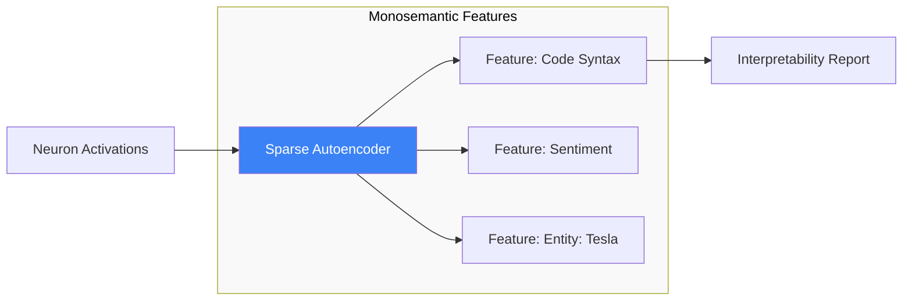

# Mechanistic Interpretability: Reverse-Engineering the Black Box

**Mechanistic Interpretability** is a research field that aims to understand the internal representations and computations of neural networks by decomposing them into human-understandable algorithms. It treats a neural network like a complex piece of compiled machine code that needs to be decompiled.

## 1. From Black-box to Circuit

Traditional interpretability looks at *what* a model does (e.g., Saliency Maps). Mechanistic interpretability asks *how* it does it:
- **Neurons**: The basic units of computation.
- **Features**: Concepts represented by directions in activation space (e.g., a "Golden Gate Bridge" feature).
- **Circuits**: Subgraphs of the model (neurons and weights) that perform a specific task, such as indirect object identification or induction.

## 2. Key Techniques

### A. Logit Lens and Path Patching
- **Logit Lens**: Projecting intermediate layer activations back into the vocabulary space to see what the model is "thinking" at each step.
- **Activation Patching**: Swapping activations from one prompt into another to identify which specific neurons are responsible for a particular output (e.g., finding the neurons that decide the gender of a pronoun).

### B. Sparse Autoencoders (SAEs)
Neurons are often **Polysemantic** (one neuron fires for many unrelated things). SAEs are used to decompose these polysemantic activations into a larger set of **Monosemantic Features**.
1.  Train an autoencoder on model activations with a sparsity constraint.
2.  The hidden units of the SAE often correspond to clean, single concepts (e.g., "legal text," "Python code," "deception").

## 3. Superposition Theory

Why are models black-boxes? The **Superposition Hypothesis** suggests that models store more features than they have dimensions. They use "interference" to pack multiple concepts into the same neurons. 
- Interpreting a model in superposition is like trying to listen to 10 conversations in a crowded room. SAEs help "unmix" these signals.

## 4. Why it Matters for AI Safety

Mechanistic interpretability is the ultimate "Lie Detector" for AI.
1.  **Deception Detection**: If a model is planning to hide its true intentions from its creators, we might see a "Deception Circuit" fire during the alignment process.
2.  **Robustness**: Understanding how a model solves a problem allows us to predict when it will fail (e.g., on out-of-distribution data).
3.  **Verification**: We can mathematically prove that a model uses a certain logic, rather than just guessing based on its output.

## Visualization: Feature Decomposition

## Related Topics

[[transformer-architecture]] — the object of study  
[[constitutional-ai]] — verifying alignment at the circuit level  
[[information-geometry]] — geometric view of feature spaces
---
