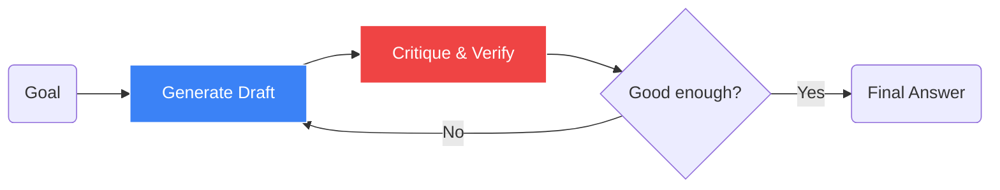

# Agentic Design Patterns

## What Is It

Agentic Design Patterns are the architectural "blueprints" used to build reliable autonomous systems with LLMs. Andrew Ng famously argued that **Agentic Workflows**—iterative loops where the model can correct itself—can make a smaller model outperform a much larger model used in a single pass.

Instead of a single prompt, we build a system that can plan, reflect, and collaborate.

## Core Patterns

### 1. Reflection (Self-Correction)



The model generates an output, then a second prompt (or a different model) is used to critique that output and suggest improvements. 
- **Workflow**: `Draft` $\to$ `Critique` $\to$ `Revised Draft`.
- **Why**: Drastically reduces hallucinations and formatting errors.

### 2. Planning
The model breaks a complex goal into a sequence of sub-tasks before executing them.
- **Workflow**: `Goal` $\to$ `Plan` $\to$ `Step 1` $\to$ `Step 2` $\dots$ $\to$ `Final Result`.
- **Frameworks**: BabyAGI, AutoGPT.

### 3. Tool Use (Reasoning + Acting)
The model observes the environment, reasons about what to do, and takes an action (calling an API).
- **Frameworks**: **ReAct** (Reason + Act).
- **New Standard**: [[mcp|Model Context Protocol (MCP)]] for standardized tool access.

### 4. Multi-Agent Collaboration
Assigning different roles to different [[llm]] instances (e.g., a "Coder", a "Reviewer", and a "Manager") and letting them talk to each other.
- **Why**: Specialization leads to higher quality. A "Reviewer" agent is better at catching bugs than the "Coder" agent is at checking its own work.

## Visualization: Single Pass vs. Agentic

```chart
{
  "type": "line",
  "xAxis": "iterations",
  "data": [
    {"iterations": 0, "gpt4_zero_shot": 67, "gpt35_agentic": 42},
    {"iterations": 1, "gpt4_zero_shot": 67, "gpt35_agentic": 65},
    {"iterations": 2, "gpt4_zero_shot": 67, "gpt35_agentic": 74},
    {"iterations": 3, "gpt4_zero_shot": 67, "gpt35_agentic": 81}
  ],
  "lines": [
    {"dataKey": "gpt4_zero_shot", "stroke": "#ef4444", "name": "GPT-4 (Single Pass)"},
    {"dataKey": "gpt35_agentic", "stroke": "#3b82f6", "name": "GPT-3.5 (Agentic Loop)"}
  ]
}
```

## Mathematical Perspective: Iterative Refinement

We can view agentic workflows as a Markov Chain where the state $s_{t+1}$ is produced by the model conditioned on previous attempts and feedback:

$$P(y \mid x) \approx \int P(y \mid x, z_{refine}) P(z_{refine} \mid x, y_{initial}) dy_{initial}$$

By sampling and refining, we move closer to the global optimum of the task objective than a single greedy decode would allow.

## Implementation: Simple Reflection Pattern

```python
def generate_with_reflection(prompt):
    # Step 1: Initial Generation
    draft = llm.generate(f"Solve this: {prompt}")
    
    # Step 2: Critique
    critique = llm.generate(f"Critique this solution and find errors: {draft}")
    
    # Step 3: Revision
    final = llm.generate(f"Improve the solution based on this critique: {critique}")
    
    return final
```

## Related Topics

[[agents]] — the broader concept  
[[tool-use]] — how agents interact with the world  
[[mcp]] — the protocol for agent interoperability
