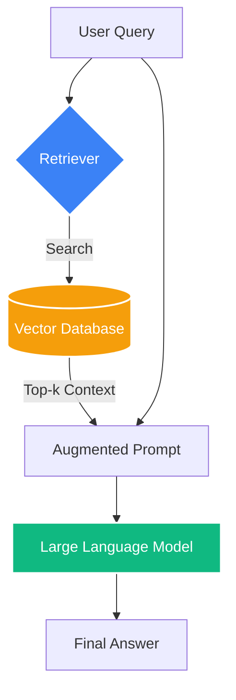

# RAG (Retrieval-Augmented Generation)

## Overview

Retrieval-Augmented Generation (RAG) is an architectural pattern that enhances large language model outputs by supplying relevant external documents at inference time. Instead of relying solely on knowledge encoded during pre-training, a RAG system first retrieves a small set of relevant passages from a corpus, then conditions the model's generation on those passages alongside the original query.

The motivation is straightforward: LLMs have a fixed knowledge cutoff and a finite context window. They hallucinate facts when asked about proprietary data, recent events, or long-tail topics. RAG sidesteps both problems without the cost of continuous [[fine-tuning]].

## Architecture Workflow



## The Advanced Pipeline

A modern production RAG system moves beyond a simple "Retrieve $\to$ Generate" loop to a multi-stage pipeline:

1.  **Pre-Retrieval (Query Transformation)**:
    - **HyDE (Hypothetical Document Embeddings)**: The [[llm]] generates a fake "perfect" answer, which is then used to search the database.
    - **Multi-Query**: Generating multiple versions of the user's question to capture different semantic angles.
2.  **Retrieval (Hybrid Search)**:
    - Combining **Vector Search** (Semantic) with **Keyword Search** (BM25/Full-text) to catch specific technical terms or IDs.
3.  **Post-Retrieval (Reranking)**:
    - Using a **Cross-Encoder Reranker** (like BGE-Reranker) to score the top-100 retrieved documents more accurately.
4.  **Context Compression**:
    - Removing redundant or irrelevant sentences from the retrieved chunks to save tokens and reduce "lost in the middle" effects.

## Mathematical Framework: RRF

To combine scores from different search methods (e.g., BM25 and Vector), we use **Reciprocal Rank Fusion (RRF)**:

$$RRFscore(d) = \sum_{k \in \mathcal{K}} \frac{1}{k + rank(d, k)}$$

where $\mathcal{K}$ is the set of retrieval methods and $k$ is a constant (usually 60).

## Visualization: Retrieval Precision

```chart
{
  "type": "bar",
  "xAxis": "method",
  "data": [
    {"method": "Naive Vector", "hit_rate": 62},
    {"method": "Hybrid (V+BM25)", "hit_rate": 78},
    {"method": "Hybrid + Rerank", "hit_rate": 89},
    {"method": "GraphRAG", "hit_rate": 94}
  ],
  "lines": [
    {"dataKey": "hit_rate", "stroke": "#3b82f6", "name": "Hit Rate @ 10 (%)"}
  ]
}
```

## GraphRAG: The Next Frontier

GraphRAG combines vector search with **Knowledge Graphs**. Instead of just looking for similar text chunks, it explores relationships between entities. 
- **Global Queries**: "What are the main themes in this 1000-page dataset?" (Hard for Vector, easy for Graph).
- **Relational Reasoning**: Connecting concepts that are mentioned in different documents.

## Evaluation: RAGAS

The RAGAS framework measures the quality of the pipeline using four key metrics:
- **Faithfulness**: Is the answer supported by the context?
- **Answer Relevance**: Is the answer semantically aligned with the question?
- **Context Recall**: Does the context contain all information needed?
- **Context Precision**: How much of the context is actually relevant?

## Related Topics

[[vector-databases]] — where the data lives  
[[embedding-models]] — the engine of retrieval  
[[tool-use]] — RAG as a tool for agents  
[[llm-financial-analysis]] — RAG in quantitative finance
---
