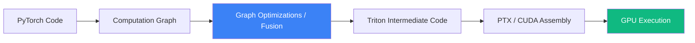

# Deep Learning Compilers and Kernel Fusion

Writing code in PyTorch is easy, but PyTorch executes operations eagerly, one by one. If you write a complex mathematical formula, standard PyTorch will call a separate C++/CUDA program (a "kernel") for every single addition, multiplication, and activation function. This leads to massive performance bottlenecks due to memory IO. **Deep Learning Compilers** solve this problem.

## The Problem: Kernel Launch Overhead and Memory Bound

Consider a simple LayerNorm operation in PyTorch:
`y = (x - mean) / std * weight + bias`

If executed naively, PyTorch will:
1.  Read `x` from [[flash-attention|HBM]] to compute `mean`, write `mean` back to HBM.
2.  Read `x` and `mean` to compute `std`, write `std` to HBM.
3.  Read `x`, `mean`, `std`, subtract and divide, write result to HBM.
4.  Read result, `weight`, `bias`, multiply and add, write final `y` to HBM.

The [[inference-serving|GPU]] spends 95% of its time moving temporary variables in and out of the slow HBM memory, and only 5% actually doing math. 

## The Solution: Operator Fusion

**Operator Fusion** (Kernel Fusion) merges all these small steps into a single, massive CUDA kernel.
In a fused kernel, a chunk of `x` is loaded into the ultra-fast [[flash-attention|SRAM]] (registers), all the math (mean, std, sub, div, mul, add) is done on-chip without ever saving intermediate results to HBM, and only the final `y` is written back. 

This can speed up operations by 10x to 50x.

## Technologies: XLA, Triton, and `torch.compile`

Writing fused CUDA kernels by hand in C++ is incredibly difficult and requires deep knowledge of hardware. DL Compilers automate this.

### 1. XLA (Accelerated Linear Algebra)
Developed by Google, XLA takes a computational graph (from JAX or TensorFlow), analyzes the whole graph, and generates highly optimized fused kernels specifically for the target hardware (GPU or TPU).

### 2. Triton
Developed by OpenAI, Triton is a Python-like language that lets AI researchers write custom GPU kernels without knowing C++. It automatically handles memory coalescing, shared memory allocation, and thread synchronization. (FlashAttention was famously re-written in Triton, making it accessible to the community).

### 3. `torch.compile` (PyTorch 2.0)
The modern PyTorch solution. You simply add `@torch.compile` above your model, and PyTorch will:
1.  Capture the computation graph (using TorchDynamo).
2.  Pass it to a compiler backend (like TorchInductor).
3.  Generate fused Triton kernels on the fly.

## Visualization: The Compilation Pipeline

## Why It Matters

As new architectures (like [[moe-routing|MoE]] or new activation functions) emerge, standard PyTorch operations become the bottleneck. DL Compilers allow researchers to invent completely new math operations and have them run at the physical speed limit of the hardware on day one, without waiting for Nvidia to write a custom C++ kernel.

## Related Topics

[[gpu-architecture]] — the hardware these compilers target  
[[hardware-io-attention]] — the memory wall that makes fusion necessary  
[[flash-attention]] — the ultimate example of a hand-fused kernel
---
