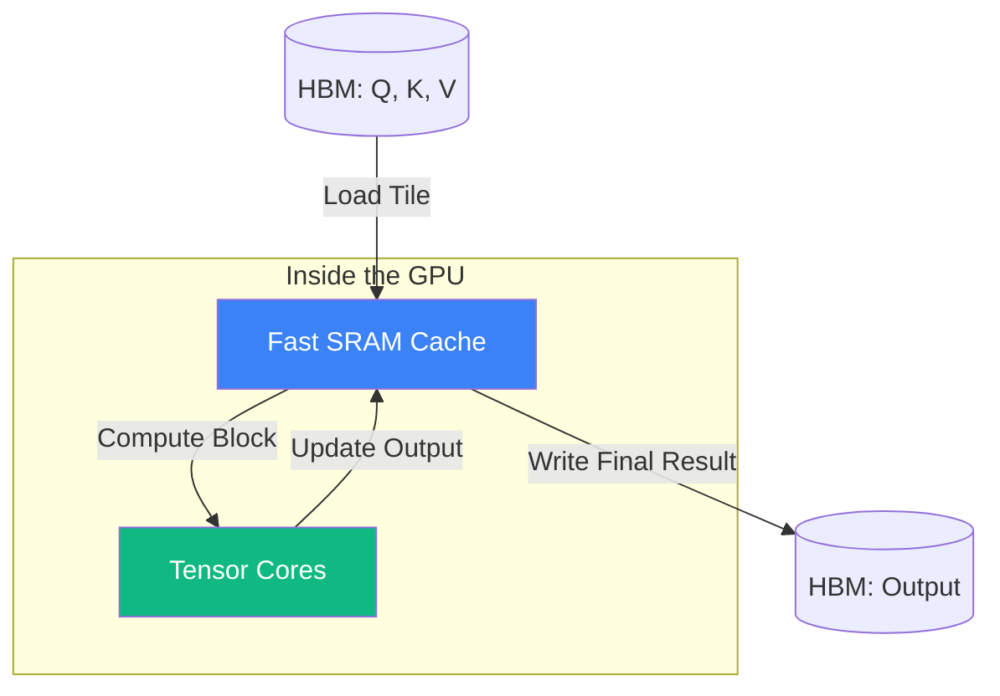

# FlashAttention: Fast and Memory-Efficient Attention with Tiling

FlashAttention, introduced by **Tri Dao et al. (2022)**, is one of the most important engineering breakthroughs in the LLM era. It enables training and inference with long context (100k+ tokens) by fundamentally changing how GPUs compute the [[attention-mechanisms|Attention]] matrix.

## 1. The Bottleneck: The Memory Wall

Standard attention (Self-Attention) has a time and memory complexity of $O(N^2)$, where $N$ is the sequence length. 
However, the real bottleneck is not the FLOPs (math), but **Memory IO**.
1.  To compute $\text{Softmax}(QK^\top)V$, the GPU must write the giant $N \times N$ attention matrix to the slow **HBM (High Bandwidth Memory)** and then read it back.
2.  For a sequence of 64k tokens, the matrix takes **16 GB** of memory for just one head!

## 2. The Solution: Tiling and Recomputation

FlashAttention makes attention **IO-Aware**. It avoids writing the $N \times N$ matrix to HBM entirely.

### A. Tiling (SRAM Management)
The algorithm breaks the $Q, K, V$ matrices into small blocks (tiles) that fit into the GPU's ultra-fast **SRAM** (the L1 cache, which is ~200x faster than HBM).
- It loads a block of $Q$ and a block of $K$.
- It computes the attention scores for that small block.
- It updates the output incrementally.

### B. Online Softmax
Normally, Softmax requires the maximum value of the *entire row* to be numerically stable. You can't calculate it block-by-block, right? 
FlashAttention uses the **Online Softmax** trick: it keeps track of the running maximum and the running sum of exponentials. When moving to the next block, it "re-scales" the previous result to maintain mathematical correctness.

### C. Recomputation (Gradient Checkpointing)
During the backward pass (training), standard attention stores the $N \times N$ matrix to compute gradients. FlashAttention **does not store it**. 
Instead, it re-calculates the necessary attention blocks on the fly during the backward pass from the blocks of $Q, K, V$ stored in HBM. 
- *The Paradox*: Doing more math (recomputing) is faster than reading from memory.

## 3. Results: Scaling to 1M Tokens

- **Speed**: 2x to 4x faster than standard PyTorch attention.
- **Memory**: Linear memory usage $O(N)$ with respect to sequence length (instead of $O(N^2)$), as the giant matrix is never materialized.
- **Impact**: This technology is what enabled models like **Claude 3** and **Gemini 1.5** to support massive context windows.

## 4. FlashAttention-2 and Beyond

FlashAttention-2 (2023) further optimized the algorithm by better partitioning work across the GPU's **Streaming Multiprocessors (SMs)** and using asynchronous memory copies, reaching close to the theoretical maximum throughput of the H100 GPU.

## Visualization: Memory Flow

*The giant $N \times N$ matrix exists only in the mind of the mathematician. The GPU only ever sees small, fast-moving tiles.*

## Related Topics

[[attention-mechanisms]] — the high-level math  
[[llm-infra/serving/hardware-io-attention]] — the physical memory wall  
[[gpu-architecture]] — SMs and Tensor Cores  
[[dl-compilers]] — how Triton automates tiling
---
