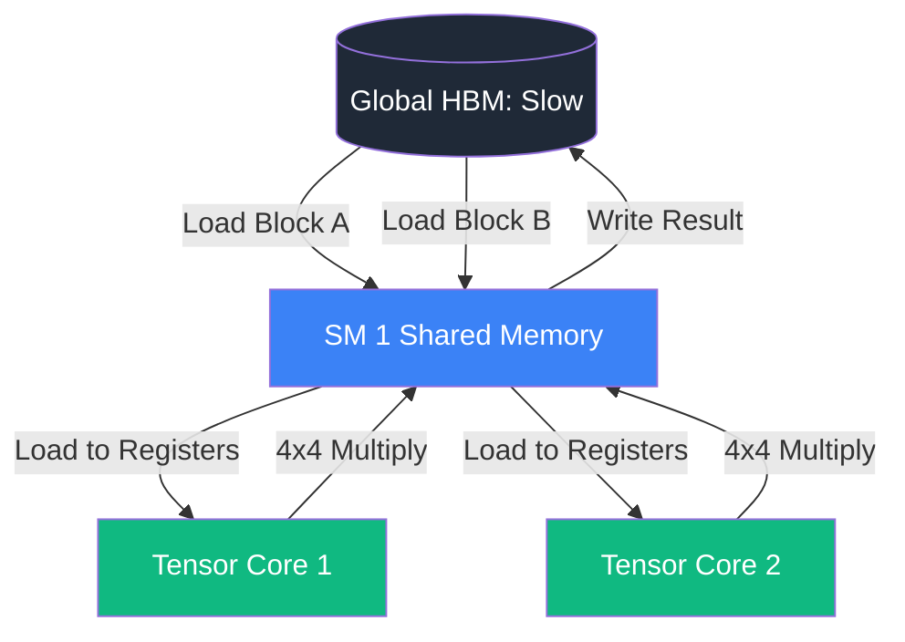

# [[inference-serving|GPU]] Architecture: SMs, Warps, and Tensor Cores

To understand why Large Language Models are designed the way they are (e.g., why hidden dimensions are multiples of 64), you have to understand the physical silicon they run on. Nvidia's GPU architecture dictates the absolute limits of AI performance.

## 1. Streaming Multiprocessors (SMs)

A GPU is not a single giant processor; it is a cluster of mini-processors called **Streaming Multiprocessors (SMs)**. 
- An Nvidia H100 has 132 SMs.
- Each SM is an independent execution unit with its own L1 Cache / Shared Memory, instruction fetchers, and execution cores.
- If a matrix multiplication doesn't have enough parallel independent chunks to give work to all 132 SMs, the GPU is "underutilized."

## 2. Threads and Warps

GPUs execute code using SIMT (Single Instruction, Multiple Threads).
- **Thread**: The smallest unit of execution.
- **Warp**: A group of **32 threads** that execute the exact same instruction at the exact same time, just on different data.

*Why is this important?* If you write code where half the threads in a warp take an `if` branch and the other half take an `else` branch (Warp Divergence), the GPU cannot run them simultaneously. It runs the `if` while the `else` threads wait, then runs the `else` while the `if` threads wait. This cuts performance in half.

## 3. Tensor Cores

Before 2017, GPUs multiplied matrices using standard CUDA cores (one multiply-add per clock cycle). 
Nvidia introduced **Tensor Cores** (starting with Volta architecture), which are specialized circuits that perform a $4 \times 4$ matrix multiply-and-accumulate ($D = A \times B + C$) in a **single clock cycle**.

- **Mixed Precision**: Tensor Cores take inputs in low precision (e.g., FP16 or INT8) but accumulate the result in high precision (FP32 or INT32) to prevent numerical underflow.
- **Alignment**: To use Tensor Cores efficiently, the dimensions of the matrices being multiplied **must be multiples of 8, 16, or 32** (depending on the precision). If you make a hidden layer of size 765 instead of 768, the GPU will have to pad it to 768 in hardware, wasting compute, or fall back to slow CUDA cores. This hardware requirement is handled automatically by modern [[dl-compilers]].

## 4. The Memory Hierarchy

As discussed in [[hardware-io-attention]], memory movement is the real bottleneck.
1.  **[[flash-attention|HBM]] (Global Memory)**: 80GB, slow. All SMs share it.
2.  **L2 Cache**: 50MB, fast. Shared across all SMs.
3.  **L1 Cache / Shared Memory**: 256KB per SM, extremely fast. Only threads within the same SM can see it.
4.  **Registers**: Private to each thread, the fastest possible memory.

Optimized CUDA kernels (like [[flash-attention]]) carefully orchestrate moving chunks of matrices from HBM $\to$ Shared Memory $\to$ Registers $\to$ Tensor Cores.

## Visualization: Matrix Multiplication

## Related Topics

[[hardware-io-attention]] — how memory bottlenecks [[attention-mechanisms|attention]]  
[[modern-quantization]] — how FP8 utilizes new Hopper Tensor Cores  
[[dl-compilers]] — how software optimizes for this hardware  
[[flash-attention]] — the golden standard of memory-fused kernels
---
