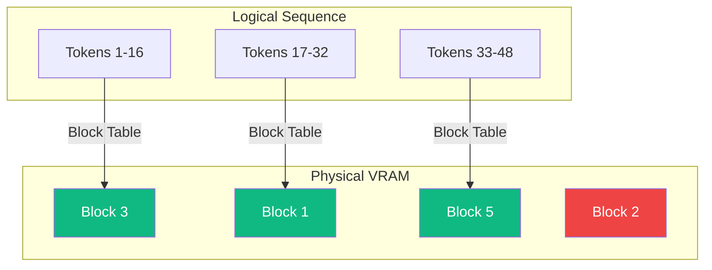

# PagedAttention and KV Cache Management

PagedAttention is a breakthrough algorithm introduced by Kwon et al. (2023) in the **vLLM** framework. It revolutionized how the Key-Value (KV) cache is stored in [[inference-serving|GPU]] memory, drastically increasing the throughput of [[llm]] inference servers.

## The Problem: Memory Fragmentation

During autoregressive generation, an LLM must store the Key and Value vectors of all past tokens to compute [[attention-mechanisms|attention]] for the next token. This is the **KV Cache**.
- **Unpredictability**: We don't know in advance how many tokens a user will generate (could be 10, could be 1000).
- **Contiguous Allocation**: Early frameworks (like HuggingFace `generate`) pre-allocated large, contiguous blocks of VRAM for the maximum possible length. 
- **Fragmentation**: This caused massive **internal fragmentation** (reserved but unused memory) and **external fragmentation** (gaps between blocks). Up to 60-80% of VRAM was wasted!

## The Solution: Operating System Inspiration

PagedAttention solves this by borrowing a concept from OS virtual memory: **Paging**.
Instead of storing the KV cache as a single contiguous tensor, it is broken down into small, fixed-size **Blocks** (e.g., 16 tokens per block).

1.  **Logical vs. Physical**: The tokens in a sequence are logically contiguous, but their physical blocks can be scattered randomly across the VRAM.
2.  **Block Tables**: The engine maintains a "Block Table" mapping logical tokens to physical block addresses.

When computing attention, the CUDA kernel looks up the block table, fetches the scattered blocks on the fly, and computes the attention scores seamlessly.

## Key Advantages

### 1. Near-Zero Waste
PagedAttention reduces memory waste to under 4% (only the last, partially filled block wastes space). This allows the server to pack many more requests into the same GPU, increasing batch sizes and throughput by **2x to 4x**.

### 2. Prompt Sharing
If multiple users send the same system prompt (or if you use techniques like Tree-of-Thoughts / Beam Search), PagedAttention allows multiple sequences to **share the same physical blocks** of KV cache. 
If a sequence needs to diverge (e.g., generate a different ending), the system performs a **Copy-on-Write (CoW)** operation, allocating a new block only for the changed tokens.

## Visualization: Paged Memory Allocation

*The physical blocks do not need to be contiguous (Block 2 is skipped/used by someone else). The Block Table acts as a virtual memory mapper.*

## Related Topics

[[inference-serving]] — the context of deployment  
[[hardware-io-attention]] — understanding VRAM limits  
[[flash-attention]] — compatible compute algorithm for the blocks
---
