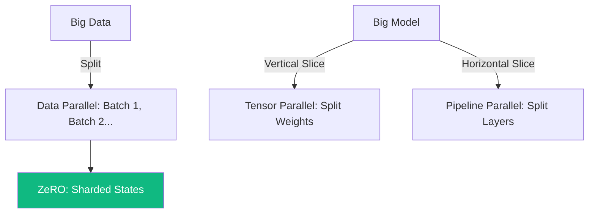

# Distributed Training: Scaling LLMs to Trillions of Parameters

A modern [[llm]] (like GPT-4 or Llama 3) is too large to fit in the memory of a single [[inference-serving|GPU]]. Even an H100 with 80GB of VRAM cannot hold the weights, gradients, and optimizer states of a 70B parameter model. **Distributed Training** is the engineering science of splitting a model across thousands of GPUs.

## 1. The Three Pillars of Parallelism

### A. Data Parallelism (DP)
Each GPU has a full copy of the model. The dataset is split, and each GPU processes a different batch.
- **Problem**: Model must fit in one GPU. 
- **Modern Solution**: **DDP (Distributed Data Parallel)** and **ZeRO**.

### B. Tensor Parallelism (TP)
Individual layers (matrices) are sliced into pieces. For a matrix multiplication $Y = XW$, one GPU computes the left half of $W$ and another computes the right half.
- **Use Case**: Intra-node communication (NVLink). It requires extremely high bandwidth because GPUs must sync after every single layer.

### C. Pipeline Parallelism (PP)
Different layers are placed on different GPUs. GPU 1 handles layers 1-10, GPU 2 handles 11-20.
- **Problem**: **Bubble Time**. While GPU 2 is waiting for GPU 1 to finish, it is idle.
- **Solution**: **Micro-batching**. Splitting the batch into tiny pieces so that multiple GPUs can work in a "pipeline" simultaneously.

## 2. ZeRO: Zero Redundancy Optimizer

Developed by Microsoft (DeepSpeed), ZeRO is a form of **FSDP (Fully Sharded Data Parallelism)**. It eliminates the redundancy of Data Parallelism:
1.  **ZeRO-1**: Shards the **Optimizer States** (saving 75% memory).
2.  **ZeRO-2**: Shards the **Gradients**.
3.  **ZeRO-3**: Shards the **Weights**. 
With ZeRO-3, no single GPU holds the full model. Weights are "fetched" on the fly just before they are needed for a specific calculation and then immediately discarded.

## 3. Communication Collectives

Distributed training relies on hardware-level primitive operations:
- **All-Reduce**: Sums data from all GPUs and sends the result back to all (used to sync gradients).
- **All-Gather**: Collects pieces from all GPUs to form a full tensor (used in ZeRO-3).
- **Reduce-Scatter**: Sums pieces and leaves a unique part on each GPU.

## 4. Why Tier-1 Engineers care

- **Efficiency**: Scaling is not linear. If you use 100 GPUs, you don't get 100x speed. You might get 80x due to communication overhead.
- **Check-pointing**: Saving the state of a 10TB model distributed across 2000 GPUs without stopping the training is a massive distributed systems challenge.

## Visualization: Parallelism Spectrum

## Related Topics

[[llm-infra/serving/hardware-io-attention]] — the VRAM bottlenecks  
[[gpu-architecture]] — the NVLink/[[flash-attention|HBM]] context  
[[llm-infra/training/fine-tuning]] — applying these to LoRA/QLoRA
---
