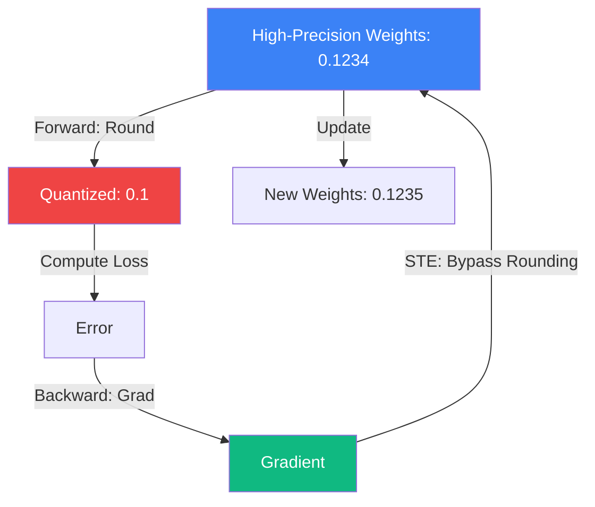

# [[quantization]] Aware Training (QAT)

While [[modern-quantization|Post-Training Quantization (PTQ)]] (like GPTQ or AWQ) happens after the model is trained, **Quantization Aware Training (QAT)** integrates the precision loss directly into the training loop. This allows the neural network to "adapt" its weights to the lower precision, resulting in significantly higher accuracy for 2-bit or 3-bit models.

## 1. The Simulated Quantization (Fake Quant)

Neural networks are trained using floating-point numbers (FP32 or BF16) because gradients require high precision. You cannot "train" a 4-bit integer directly using SGD.
In QAT, we use **Fake Quantization** nodes:
1.  During the forward pass, weights are rounded to the target precision (e.g., INT4).
2.  The model performs calculations using these "noisy" rounded weights.
3.  **The Core Problem**: The rounding function (Step function) has a derivative of zero almost everywhere. Standard [[automatic-differentiation|backpropagation]] breaks.

## 2. Straight-Through Estimator (STE)

To fix the zero-gradient problem, QAT uses the **Straight-Through Estimator (STE)**. 
- During the **Forward Pass**, we use the quantized (rounded) weights.
- During the **Backward Pass**, we pretend the rounding never happened and pass the gradients directly through to the original high-precision weights.

This "lie" allows the optimizer to update the high-precision weights in a way that compensates for the rounding error. Over time, the weights migrate to values that are robust to being rounded.

## 3. LSQ: Learned Step Size Quantization

Modern QAT doesn't just round numbers; it learns the **Step Size** ($s$) of the quantization grid as a trainable parameter.
$$Q(x) = \text{round}\left( \text{clamp}\left( \frac{x}{s}, -2^{b-1}, 2^{b-1}-1 \right) \right) \cdot s$$
By training $s$, the model automatically decides if it needs a wide dynamic range (for large weights) or a fine-grained resolution (for small weights).

## 4. QAT vs. PTQ: When to use which?

- **PTQ (Post-Training)**: Fast (minutes). Good for 4-bit or 8-bit. Almost free. Use it first.
- **QAT (Aware Training)**: Expensive (requires full training/[[fine-tuning]]). Necessary for **2-bit or 3-bit** extreme compression, or when the model is very sensitive to noise (e.g., small edge-AI models).

## 5. Modern Variant: QLoRA

**QLoRA** is a hybrid approach. It loads a base model in 4-bit (NF4) and trains 16-bit adapters ([[fine-tuning|LoRA]]) on top. While not "pure" QAT, it uses similar principles of adapting to quantization noise to achieve SOTA results with minimal VRAM.

## Visualization: STE Gradient Flow

## Related Topics

[[modern-quantization]] — the zero-cost alternative  
[[llm-infra/training/fine-tuning]] — context for QLoRA  
[[gradient-hessian-jacobian]] — why STE is needed for gradient flow
---
