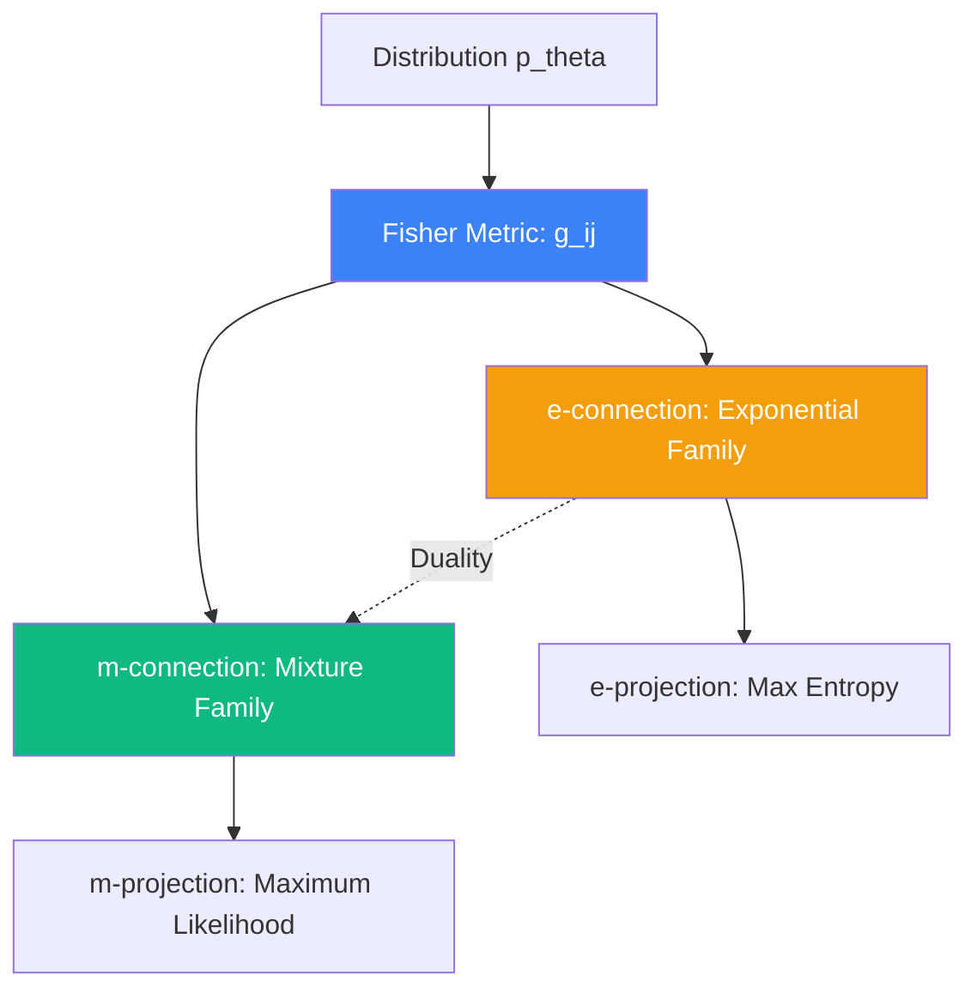

# Information Geometry: Differential Geometry of Statistical Models

**Information Geometry** (IG) provides a geometric language for statistics and machine learning by treating a family of probability distributions as a **Riemannian Manifold**. In this framework, statistical inference is viewed as a geometric projection, and learning is a movement along a geodesic path.

## 1. The Statistical Manifold and the Fisher Metric

Let $S = \{ p(x | \theta) \mid \theta \in \Theta \subset \mathbb{R}^n \}$ be a parametric family of distributions. $S$ is a smooth manifold where $\theta$ are the coordinates. 

### The Fisher Information Metric
The distance between two nearby distributions $p(x|\theta)$ and $p(x|\theta+d\theta)$ is not Euclidean. The unique invariant metric (up to a constant) is the **Fisher Information Matrix** $g(\theta)$:
$$ g_{ij}(\theta) = \mathbb{E}_\theta \left[ \frac{\partial \log p(x|\theta)}{\partial \theta_i} \frac{\partial \log p(x|\theta)}{\partial \theta_j} \right] $$
According to the **Chentsov Theorem**, the Fisher metric is the only Riemannian metric that remains invariant under sufficient statistics transformations.

## 2. Dual Connections and Invariance

Unlike standard Riemannian geometry which has one preferred connection (Levi-Civita), IG studies pairs of **Dual Connections** $(\nabla, \nabla^*)$.

### A. The e-connection and m-connection
In an **Exponential Family** (like the Normal distribution):
- The **e-connection** ($\nabla^{(1)}$) is flat in the natural parameter space $\theta$.
- The **m-connection** ($\nabla^{(-1)}$) is flat in the expectation parameter space $\eta = \mathbb{E}[X]$.
- These two connections are dual with respect to the Fisher metric:
  $$ Z \langle X, Y \rangle = \langle \nabla_Z X, Y \rangle + \langle X, \nabla^*_Z Y \rangle $$

### B. The Amari-Chentsov Tensor
The cubic tensor $C_{ijk}$ measures the failure of the Levi-Civita connection to be dual-flat. It defines the family of $\alpha$-connections:
$$ \Gamma^{(\alpha)}_{ijk} = \Gamma^{LC}_{ijk} - \frac{\alpha}{2} C_{ijk} $$

## 3. Divergence and Information Projections

A **Divergence** $D(p \| q)$ is a non-negative function that acts like a "squared distance" but is generally asymmetric (e.g., **Kullback-Leibler Divergence**).
- On a dual-flat manifold, the KL-divergence satisfies a **Generalized Pythagorean Theorem**:
  If the path from $p$ to $q$ is e-geodesic and the path from $q$ to $r$ is m-geodesic, and they are orthogonal at $q$, then:
  $$ D(p \| r) = D(p \| q) + D(q \| r) $$
- **Information Projection**: Finding the distribution in a set $M$ that is closest to $p$ in terms of KL-divergence is equivalent to a geometric projection.

## 4. Advanced Machine Learning Applications

### A. Natural Gradient Descent (NGD)
Standard SGD assumes the weight space is Euclidean. NGD uses the **Fisher-Rao distance**:
$$ \theta_{t+1} = \theta_t - \eta g(\theta)^{-1} \nabla L(\theta) $$
This ensures that the step size is measured in terms of the *change in the model's output distribution*, making the optimization invariant to reparameterization (e.g., switching from weights to logarithms of weights).

### B. Latent Space Geometry in LLMs
Information geometry is used to analyze the "curvature" of the latent space in Transformers. Regions of high curvature often correspond to "semantic transitions" or decision boundaries where the model's output distribution changes rapidly.

### C. The Information Bottleneck
IG provides the tools to formalize the Information Bottleneck principle: $\min I(X; \hat{X}) - \beta I(Y; \hat{X})$, viewing it as a competition between two projections on the manifold of representations.

## Visualization: The Dual Structure

## Related Topics

[[fisher-information]] — the core component of the metric  
stochastic-calculus — IG in stochastic processes  
[[optimal-transport]] — comparison with Wasserstein geometry
---
