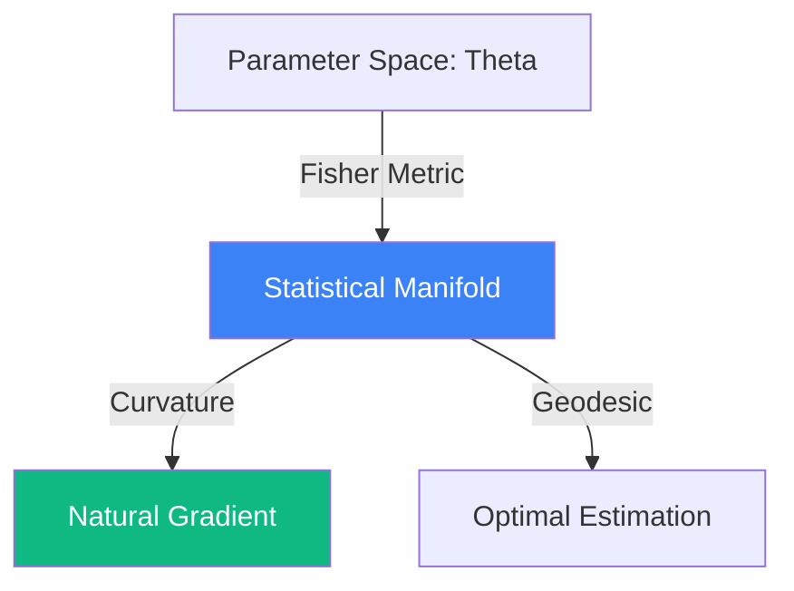

# Information Geometry: The Manifold of Probability

**Information Geometry** is a branch of mathematics that applies the techniques of differential geometry to the field of statistics and probability theory. It treats probability distributions as points on a higher-dimensional surface called a **Statistical Manifold**. 

## 1. The Statistical Manifold

Consider a family of probability distributions $p(x | \theta)$ parameterized by $\theta$ (e.g., a Normal distribution defined by mean $\mu$ and variance $\sigma^2$). 
The set of all possible $\theta$ forms a manifold $M$. To do geometry on $M$, we need a way to measure distances between distributions.

## 2. The Fisher Information Metric

The central breakthrough of Information Geometry (pioneered by Rao and Amari) is that the **Fisher Information Matrix** $g_{ij}(\theta)$ acts as a **Riemannian Metric** on the statistical manifold:
$$ g_{ij}(\theta) = \mathbb{E}_{x \sim p(x|\theta)} \left[ \frac{\partial \log p(x|\theta)}{\partial \theta_i} \frac{\partial \log p(x|\theta)}{\partial \theta_j} \right] $$

This metric defines the local distance $ds^2$ between two infinitely close distributions:
$$ ds^2 = \sum g_{ij} d\theta_i d\theta_j $$

## 3. Natural Gradient Descent

In standard Deep Learning, we use Euclidean Gradient Descent: $\theta_{t+1} = \theta_t - \eta \nabla L$. However, the loss landscape of a neural network is a statistical manifold, and Euclidean distance is not a natural measure of change in the model's behavior.
**Natural Gradient Descent** accounts for the curvature of the manifold by multiplying the gradient by the inverse of the Fisher Matrix:
$$ \theta_{t+1} = \theta_t - \eta g(\theta)^{-1} \nabla L $$
- **Result**: Faster convergence and better generalization, as the optimizer moves in the direction that changes the *output distribution* most efficiently, regardless of how the weights are parameterized.

## 4. Dually Flat Structures and Divergences

Information geometry studies **Dually Flat Connections** ($\nabla$ and $\nabla^*$). This structure links the manifold to the **Kullback-Leibler (KL) Divergence**.
- The KL-divergence acts like a "squared distance" on the manifold, but it is asymmetric.
- The Pythagorean theorem on a statistical manifold involves KL-divergences instead of squared Euclidean lengths.

## 5. Applications

1.  **Statistical Inference**: Understanding the efficiency of estimators (Cramér-Rao bound).
2.  **Machine Learning**: Natural Gradient, Information Bottleneck principle, and analyzing the geometry of LLM latent spaces.
3.  **Physics**: Thermodynamics and fluctuation-dissipation theorems can be reformulated as geometric paths on manifolds of equilibrium states.

## Visualization: The Curvature of Probability

## Related Topics

[[fisher-information]] — the matrix at the heart of the metric  
[[asymptotic-stats]] — information bounds  
[[training-dynamics]] — natural gradient in deep learning
---
